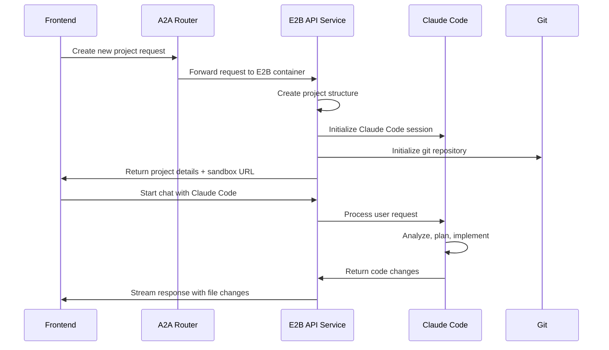
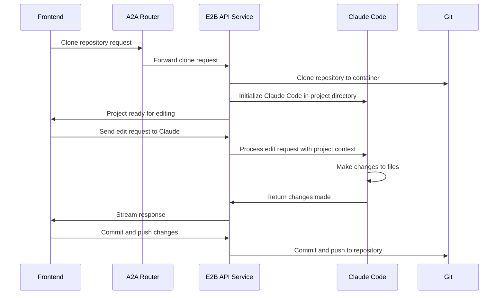
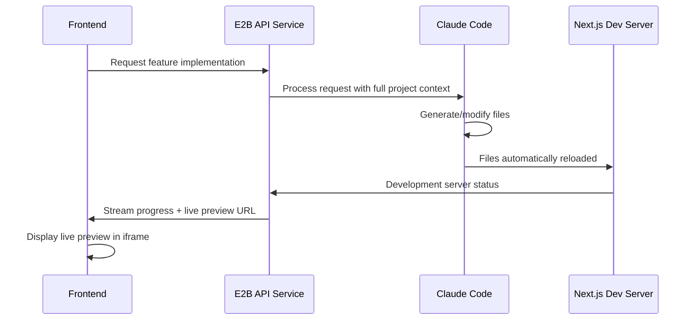

# Claude Code E2B Integration Specification

## Overview

This specification outlines a new architecture where Claude Code runs directly inside E2B containers, enabling natural development workflows similar to local development. The frontend communicates with Claude Code via the Claude Code SDK through a containerized API service.

## Architecture Components

### 1. E2B Container Stack
```
E2B Container
├── Next.js Baseline Project (Port 3000)
├── Claude Code SDK API Service (Port 8080)  
├── Git Integration
└── Environment Variables
```

### 2. Communication Flow
```
Frontend → A2A Router → E2B API Service → Claude Code SDK → Project Files
```

## Key Benefits

1. **Native Development Experience**: Claude Code works within the actual project structure
2. **Git Integration**: Direct repository cloning, editing, and pushing
3. **Real-time Collaboration**: Live editing with immediate feedback
4. **Existing App Support**: Pull existing apps from GitHub for modification
5. **Reduced Latency**: Direct file system access without external API calls

## Project Structure

```
claude-code-e2b/
├── e2b-template/
│   ├── e2b.Dockerfile           # Enhanced container with Claude Code
│   ├── api-service/             # Express API service
│   │   ├── src/
│   │   │   ├── server.ts        # Main API server
│   │   │   ├── claude-service.ts # Claude Code SDK integration
│   │   │   ├── git-service.ts   # Git operations
│   │   │   └── project-service.ts # Project management
│   │   ├── package.json
│   │   └── tsconfig.json
│   ├── baseline-project/        # Enhanced baseline with API integration
│   │   ├── app/
│   │   ├── components/
│   │   ├── lib/
│   │   └── api/                 # Client-side API integration
│   └── scripts/
│       ├── start-services.sh    # Start both Next.js and API service
│       └── setup-git.sh         # Git configuration
├── frontend-integration/        # Frontend components for new flow
│   ├── components/
│   │   ├── ClaudeCodeChat.tsx   # Chat interface
│   │   ├── ProjectManager.tsx   # Project operations
│   │   └── GitIntegration.tsx   # Git operations UI
│   └── hooks/
│       ├── useClaudeCode.ts     # Claude Code API hook
│       └── useProject.ts        # Project management hook
└── docs/
    ├── api-reference.md         # API endpoints documentation
    ├── deployment.md            # Deployment guide
    └── development.md           # Development workflow
```

## API Endpoints

### Core Claude Code Integration

#### POST /api/claude/chat
Start or continue conversation with Claude Code
```typescript
interface ChatRequest {
  message: string
  conversationId?: string
  systemPrompt?: string
  maxTurns?: number
  projectContext?: {
    currentFile?: string
    selectedText?: string
    gitBranch?: string
  }
}

interface ChatResponse {
  conversationId: string
  messages: Array<{
    role: 'user' | 'assistant'
    content: string
    timestamp: string
  }>
  actions?: Array<{
    type: 'file_created' | 'file_modified' | 'command_executed'
    details: any
  }>
}
```

#### GET /api/claude/conversation/:id
Retrieve conversation history

#### DELETE /api/claude/conversation/:id  
Clear conversation history

### Project Management

#### POST /api/project/create
Create new project from template
```typescript
interface CreateProjectRequest {
  name: string
  template?: 'nextjs' | 'react' | 'vue' | 'custom'
  gitRepo?: string
  description?: string
}
```

#### POST /api/project/clone
Clone existing repository
```typescript
interface CloneProjectRequest {
  gitUrl: string
  branch?: string
  credentials?: {
    token: string
    type: 'github' | 'gitlab' | 'custom'
  }
}
```

#### GET /api/project/status
Get current project status and structure

#### POST /api/project/build
Build the current project

#### POST /api/project/preview
Start development server and return preview URL

### Git Operations

#### POST /api/git/commit
Commit changes
```typescript
interface CommitRequest {
  message: string
  files?: string[] // Specific files to commit, or all if empty
  author?: {
    name: string
    email: string
  }
}
```

#### POST /api/git/push
Push to remote repository

#### GET /api/git/status
Get git status

#### POST /api/git/branch
Create or switch branch
```typescript
interface BranchRequest {
  name: string
  action: 'create' | 'switch' | 'create_and_switch'
  from?: string
}
```

### File Operations

#### GET /api/files/tree
Get project file tree

#### GET /api/files/content/:path
Get file content

#### POST /api/files/save
Save file content
```typescript
interface SaveFileRequest {
  path: string
  content: string
  createDirectories?: boolean
}
```

#### DELETE /api/files/:path
Delete file or directory

## Implementation Flows

### 1. New Project Creation Flow


### 2. Existing Project Edit Flow


### 3. Real-time Development Flow


## Technical Implementation Details

### E2B Container Setup

The enhanced E2B container includes:

1. **Base Environment**
   - Node.js 20+
   - Git
   - Claude Code SDK
   - Next.js development dependencies

2. **API Service** (Express.js on port 8080)
   - Claude Code SDK integration
   - WebSocket support for real-time updates
   - File system operations
   - Git operations wrapper
   - Process management for Next.js dev server

3. **Next.js Application** (Port 3000)
   - Enhanced baseline project
   - API integration for Claude Code communication
   - Real-time file watching
   - Git status integration

### Authentication & Security

1. **Claude Code Authentication**
   - Anthropic API key via environment variables
   - Per-session authentication tokens

2. **Git Authentication**
   - GitHub tokens for repository operations
   - SSH key management for private repositories

3. **Container Security**
   - Isolated file system per project
   - Resource limits and monitoring
   - Automatic cleanup of inactive sessions

### Frontend Integration

The frontend gains new capabilities:

1. **Enhanced Chat Interface**
   - Real-time streaming responses
   - File change visualization
   - Code diff display
   - Live preview integration

2. **Project Management UI**
   - Repository cloning interface
   - Branch management
   - File explorer with edit capabilities
   - Git operations dashboard

3. **Development Tools**
   - Integrated terminal access
   - Live preview with hot reload
   - Build status monitoring
   - Error reporting and debugging

## Migration Strategy

### Phase 1: Core Infrastructure
1. Create enhanced E2B template with Claude Code SDK
2. Implement basic API service with chat functionality
3. Test Claude Code integration in container environment

### Phase 2: Project Management
1. Add git integration and repository operations
2. Implement project creation and cloning flows  
3. Add file management capabilities

### Phase 3: Frontend Integration
1. Create new frontend components for Claude Code interaction
2. Implement real-time communication with WebSockets
3. Add project management UI components

### Phase 4: Advanced Features
1. Add collaborative editing capabilities
2. Implement advanced git workflows (PRs, merging)
3. Add deployment automation
4. Performance optimization and monitoring

## Success Metrics

1. **Development Speed**: Time from idea to working prototype
2. **Code Quality**: Automated testing and linting integration
3. **User Experience**: Seamless workflow between chat and development
4. **Reliability**: Container stability and error recovery
5. **Performance**: Response times and resource utilization

## Future Enhancements

1. **Multi-language Support**: Beyond Next.js/React applications
2. **Advanced Git Workflows**: Pull request creation, code review integration
3. **Deployment Integration**: Direct deployment to Vercel, Netlify, etc.
4. **Collaborative Features**: Multiple users working on same project
5. **AI-Powered Testing**: Automatic test generation and execution
6. **Performance Monitoring**: Real-time application performance insights

This architecture provides a natural, powerful development environment that combines the best of local development with cloud-based AI assistance, enabling rapid prototyping and professional development workflows.