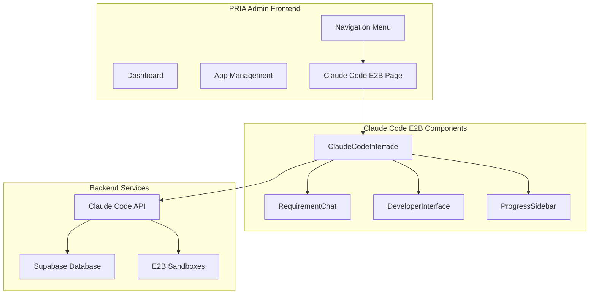

# PRIA Frontend Integration Guide: Claude Code E2B

## 🎯 Overview

This document provides step-by-step instructions for integrating Claude Code E2B into the PRIA admin frontend, enabling users to create AI-powered applications through both conversational and developer interfaces.

## 🏗️ Integration Architecture



## 📋 Prerequisites

Before integrating, ensure you have:

- ✅ PRIA admin frontend running (Next.js 15, React 19)
- ✅ Supabase project with PRIA workspace schema
- ✅ E2B API access and configuration
- ✅ Claude API access (Anthropic API key)
- ✅ shadcn/ui components installed

## 🚀 Step-by-Step Integration

### Step 1: Install Dependencies

Add the required dependencies to your PRIA frontend:

```bash
# In your PRIA admin frontend directory
npm install @anthropic-ai/sdk typescript @types/node
```

### Step 2: Copy Claude Code Components

Copy the Claude Code E2B components to your PRIA frontend:

```bash
# Create the Claude Code directory structure
mkdir -p components/claude-code
mkdir -p hooks/claude-code
mkdir -p lib/claude-code

# Copy components
cp agents/claude-code-e2b/components/* components/claude-code/
cp agents/claude-code-e2b/hooks/* hooks/claude-code/
cp agents/claude-code-e2b/src/* lib/claude-code/
```

### Step 3: Update Supabase Schema

Add the Claude Code tables to your Supabase database:

```sql
-- Execute in Supabase SQL Editor

-- Claude Code Sessions Table
CREATE TABLE IF NOT EXISTS claude_sessions (
    id UUID PRIMARY KEY DEFAULT gen_random_uuid(),
    workspace_id UUID NOT NULL REFERENCES workspace(id),
    user_id UUID NOT NULL,
    mode TEXT NOT NULL CHECK (mode IN ('business', 'developer')),
    status TEXT NOT NULL CHECK (status IN ('discovering', 'planning', 'generating', 'reviewing', 'completed')),
    requirements JSONB,
    specification JSONB,
    e2b_sandbox_id TEXT,
    e2b_sandbox_url TEXT,
    git_repository_url TEXT,
    created_at TIMESTAMPTZ DEFAULT now(),
    updated_at TIMESTAMPTZ DEFAULT now()
);

-- Progress Events Table
CREATE TABLE IF NOT EXISTS claude_progress_events (
    id BIGSERIAL PRIMARY KEY,
    session_id UUID NOT NULL REFERENCES claude_sessions(id),
    workspace_id UUID NOT NULL REFERENCES workspace(id),
    event_type TEXT NOT NULL,
    event_data JSONB,
    created_at TIMESTAMPTZ DEFAULT now()
);

-- Enable Row-Level Security
ALTER TABLE claude_sessions ENABLE ROW LEVEL SECURITY;
ALTER TABLE claude_progress_events ENABLE ROW LEVEL SECURITY;

-- Create workspace isolation policies
CREATE POLICY "workspace_isolation" ON claude_sessions
FOR ALL USING (workspace_id = (jwt.claims->>'workspace_id')::uuid);

CREATE POLICY "workspace_isolation" ON claude_progress_events  
FOR ALL USING (workspace_id = (jwt.claims->>'workspace_id')::uuid);

-- Create indexes for performance
CREATE INDEX idx_claude_sessions_workspace_id ON claude_sessions(workspace_id);
CREATE INDEX idx_claude_sessions_user_id ON claude_sessions(user_id);
CREATE INDEX idx_claude_sessions_status ON claude_sessions(status);
CREATE INDEX idx_claude_progress_events_session_id ON claude_progress_events(session_id);
```

### Step 4: Environment Variables

Add the required environment variables to your PRIA frontend `.env.local`:

```bash
# Claude API Configuration
ANTHROPIC_API_KEY=your_anthropic_api_key_here

# E2B Configuration  
E2B_API_KEY=your_e2b_api_key_here
E2B_TEMPLATE_ID=your_e2b_template_id_here

# Claude Code E2B Configuration
CLAUDE_CODE_E2B_ENDPOINT=https://claude-code-e2b.agents.pria.ai
```

### Step 5: API Routes

Create the API routes in your PRIA frontend:

**`app/api/claude-sessions/route.ts`:**
```typescript
import { NextRequest, NextResponse } from 'next/server'
import { cookies } from 'next/headers'
import createServerClient from '@/lib/supabase/server'
import { supabaseIntegration } from '@/lib/claude-code/supabase-integration'

export async function POST(request: NextRequest) {
  try {
    const cookieStore = cookies()
    const supabase = createServerClient(cookieStore)
    const { data: { user } } = await supabase.auth.getUser()

    if (!user) {
      return NextResponse.json({ error: 'Authentication required' }, { status: 401 })
    }

    const workspaceId = user.app_metadata?.workspace_id
    if (!workspaceId) {
      return NextResponse.json({ error: 'Workspace ID not found' }, { status: 403 })
    }

    const body = await request.json()
    const { mode, requirements } = body

    const result = await supabaseIntegration.createSession({
      workspace_id: workspaceId,
      user_id: user.id,
      mode,
      requirements
    })

    if (result.error) {
      return NextResponse.json({ error: result.error }, { status: 500 })
    }

    return NextResponse.json({ session_id: result.data?.id })
  } catch (error) {
    console.error('Failed to create Claude session:', error)
    return NextResponse.json({ error: 'Internal server error' }, { status: 500 })
  }
}

export async function GET(request: NextRequest) {
  try {
    const cookieStore = cookies()
    const supabase = createServerClient(cookieStore)
    const { data: { user } } = await supabase.auth.getUser()

    if (!user) {
      return NextResponse.json({ error: 'Authentication required' }, { status: 401 })
    }

    const workspaceId = user.app_metadata?.workspace_id
    if (!workspaceId) {
      return NextResponse.json({ error: 'Workspace ID not found' }, { status: 403 })
    }

    const url = new URL(request.url)
    const mode = url.searchParams.get('mode') as 'business' | 'developer' | undefined
    const status = url.searchParams.get('status') as any
    const limit = url.searchParams.get('limit') ? parseInt(url.searchParams.get('limit')!) : undefined

    const result = await supabaseIntegration.getWorkspaceSessions(workspaceId, {
      user_id: user.id,
      mode,
      status,
      limit
    })

    if (result.error) {
      return NextResponse.json({ error: result.error }, { status: 500 })
    }

    return NextResponse.json({ sessions: result.data })
  } catch (error) {
    console.error('Failed to get Claude sessions:', error)
    return NextResponse.json({ error: 'Internal server error' }, { status: 500 })
  }
}
```

**`app/api/claude-sessions/[sessionId]/route.ts`:**
```typescript
import { NextRequest, NextResponse } from 'next/server'
import { cookies } from 'next/headers'
import createServerClient from '@/lib/supabase/server'
import { supabaseIntegration } from '@/lib/claude-code/supabase-integration'

export async function GET(
  request: NextRequest,
  { params }: { params: { sessionId: string } }
) {
  try {
    const cookieStore = cookies()
    const supabase = createServerClient(cookieStore)
    const { data: { user } } = await supabase.auth.getUser()

    if (!user) {
      return NextResponse.json({ error: 'Authentication required' }, { status: 401 })
    }

    const workspaceId = user.app_metadata?.workspace_id
    if (!workspaceId) {
      return NextResponse.json({ error: 'Workspace ID not found' }, { status: 403 })
    }

    const result = await supabaseIntegration.getSession(params.sessionId, workspaceId)

    if (result.error) {
      return NextResponse.json({ error: result.error }, { status: 500 })
    }

    return NextResponse.json({ session: result.data })
  } catch (error) {
    console.error('Failed to get Claude session:', error)
    return NextResponse.json({ error: 'Internal server error' }, { status: 500 })
  }
}

export async function PATCH(
  request: NextRequest,
  { params }: { params: { sessionId: string } }
) {
  try {
    const cookieStore = cookies()
    const supabase = createServerClient(cookieStore)
    const { data: { user } } = await supabase.auth.getUser()

    if (!user) {
      return NextResponse.json({ error: 'Authentication required' }, { status: 401 })
    }

    const workspaceId = user.app_metadata?.workspace_id
    if (!workspaceId) {
      return NextResponse.json({ error: 'Workspace ID not found' }, { status: 403 })
    }

    const updates = await request.json()
    const result = await supabaseIntegration.updateSession(params.sessionId, updates)

    if (result.error) {
      return NextResponse.json({ error: result.error }, { status: 500 })
    }

    return NextResponse.json({ session: result.data })
  } catch (error) {
    console.error('Failed to update Claude session:', error)
    return NextResponse.json({ error: 'Internal server error' }, { status: 500 })
  }
}
```

### Step 6: Navigation Integration

Update your PRIA admin navigation to include Claude Code E2B:

**`components/navigation.tsx`:**
```typescript
import { Code2, Zap } from 'lucide-react'

// Add to your navigation items
const navigationItems = [
  // ... existing items
  {
    title: 'AI App Builder',
    href: '/claude-code',
    icon: Code2,
    description: 'Create applications with AI assistance'
  },
  // ... other items
]
```

### Step 7: Main Claude Code Page

Create the main Claude Code page in your PRIA admin frontend:

**`app/(dashboard)/claude-code/page.tsx`:**
```typescript
'use client'

import { useState, useEffect } from 'react'
import { useRouter, useSearchParams } from 'next/navigation'
import { ClaudeCodeInterface } from '@/components/claude-code/claude-code-interface'
import { Card, CardContent, CardHeader, CardTitle } from '@/components/ui/card'
import { Button } from '@/components/ui/button'
import { Badge } from '@/components/ui/badge'
import { Plus, Clock, CheckCircle, Code2 } from 'lucide-react'

export default function ClaudeCodePage() {
  const router = useRouter()
  const searchParams = useSearchParams()
  const sessionId = searchParams.get('session')
  
  const [recentSessions, setRecentSessions] = useState([])
  const [isLoading, setIsLoading] = useState(true)

  useEffect(() => {
    fetchRecentSessions()
  }, [])

  const fetchRecentSessions = async () => {
    try {
      const response = await fetch('/api/claude-sessions?limit=5')
      if (response.ok) {
        const data = await response.json()
        setRecentSessions(data.sessions || [])
      }
    } catch (error) {
      console.error('Failed to fetch recent sessions:', error)
    } finally {
      setIsLoading(false)
    }
  }

  const handleNewSession = () => {
    router.push('/claude-code?new=true')
  }

  const handleSessionSelect = (sessionId: string) => {
    router.push(`/claude-code?session=${sessionId}`)
  }

  // If a session is selected or we're creating new, show the interface
  if (sessionId || searchParams.get('new')) {
    return (
      <ClaudeCodeInterface
        workspaceId={''} // Will be extracted from user context
        userId={''} // Will be extracted from user context
        sessionId={sessionId || undefined}
        onSessionCreated={(newSessionId) => {
          router.push(`/claude-code?session=${newSessionId}`)
        }}
      />
    )
  }

  // Show the landing/dashboard page
  return (
    <div className="container mx-auto px-4 py-8">
      <div className="mb-8">
        <div className="flex items-center justify-between">
          <div>
            <h1 className="text-3xl font-bold flex items-center gap-3">
              <Code2 className="h-8 w-8 text-blue-600" />
              AI App Builder
            </h1>
            <p className="text-muted-foreground mt-2">
              Create applications using AI-powered development with Claude Code
            </p>
          </div>
          <Button onClick={handleNewSession} size="lg">
            <Plus className="h-4 w-4 mr-2" />
            New Application
          </Button>
        </div>
      </div>

      <div className="grid grid-cols-1 md:grid-cols-3 gap-6 mb-8">
        <Card>
          <CardContent className="p-6">
            <div className="text-center space-y-2">
              <div className="mx-auto w-12 h-12 bg-green-100 rounded-full flex items-center justify-center">
                <Code2 className="h-6 w-6 text-green-600" />
              </div>
              <h3 className="font-semibold">Business User Mode</h3>
              <p className="text-sm text-muted-foreground">
                Create apps through conversation
              </p>
            </div>
          </CardContent>
        </Card>

        <Card>
          <CardContent className="p-6">
            <div className="text-center space-y-2">
              <div className="mx-auto w-12 h-12 bg-purple-100 rounded-full flex items-center justify-center">
                <Code2 className="h-6 w-6 text-purple-600" />
              </div>
              <h3 className="font-semibold">Developer Mode</h3>
              <p className="text-sm text-muted-foreground">
                Full development environment
              </p>
            </div>
          </CardContent>
        </Card>

        <Card>
          <CardContent className="p-6">
            <div className="text-center space-y-2">
              <div className="mx-auto w-12 h-12 bg-blue-100 rounded-full flex items-center justify-center">
                <CheckCircle className="h-6 w-6 text-blue-600" />
              </div>
              <h3 className="font-semibold">PRIA Compliant</h3>
              <p className="text-sm text-muted-foreground">
                Enterprise-grade security
              </p>
            </div>
          </CardContent>
        </Card>
      </div>

      <Card>
        <CardHeader>
          <CardTitle className="flex items-center gap-2">
            <Clock className="h-5 w-5" />
            Recent Sessions
          </CardTitle>
        </CardHeader>
        <CardContent>
          {isLoading ? (
            <div className="text-center py-8 text-muted-foreground">
              Loading recent sessions...
            </div>
          ) : recentSessions.length === 0 ? (
            <div className="text-center py-8">
              <Code2 className="h-12 w-12 mx-auto text-muted-foreground mb-4" />
              <h3 className="text-lg font-semibold mb-2">No sessions yet</h3>
              <p className="text-muted-foreground mb-4">
                Create your first AI-powered application to get started.
              </p>
              <Button onClick={handleNewSession}>
                <Plus className="h-4 w-4 mr-2" />
                Create First App
              </Button>
            </div>
          ) : (
            <div className="space-y-4">
              {recentSessions.map((session: any) => (
                <div
                  key={session.id}
                  className="flex items-center justify-between p-4 border rounded-lg hover:bg-muted/50 cursor-pointer"
                  onClick={() => handleSessionSelect(session.id)}
                >
                  <div className="flex items-center gap-3">
                    <div className="w-10 h-10 bg-blue-100 rounded-full flex items-center justify-center">
                      <Code2 className="h-5 w-5 text-blue-600" />
                    </div>
                    <div>
                      <h4 className="font-medium">
                        {session.requirements?.title || `${session.mode} App`}
                      </h4>
                      <p className="text-sm text-muted-foreground">
                        Created {new Date(session.created_at).toLocaleDateString()}
                      </p>
                    </div>
                  </div>
                  <div className="flex items-center gap-2">
                    <Badge variant={getStatusVariant(session.status)}>
                      {session.status}
                    </Badge>
                    <Badge variant="outline">
                      {session.mode}
                    </Badge>
                  </div>
                </div>
              ))}
            </div>
          )}
        </CardContent>
      </Card>
    </div>
  )
}

function getStatusVariant(status: string): "default" | "secondary" | "destructive" | "outline" {
  switch (status) {
    case 'completed':
      return 'default'
    case 'generating':
      return 'secondary'
    case 'reviewing':
      return 'outline'
    default:
      return 'secondary'
  }
}
```

### Step 8: User Context Integration

Update your components to use PRIA's user context:

**`lib/claude-code/user-context.ts`:**
```typescript
'use client'

import { useUser } from '@/hooks/use-user' // Your existing PRIA user hook
import { useWorkspace } from '@/hooks/use-workspace' // Your existing PRIA workspace hook

export function useClaudeCodeContext() {
  const { user } = useUser()
  const { workspace } = useWorkspace()

  return {
    userId: user?.id || '',
    workspaceId: workspace?.id || '',
    isAuthenticated: !!user,
    hasWorkspace: !!workspace
  }
}
```

### Step 9: Permission Integration

Add Claude Code permissions to your PRIA permission system:

**Database Migration:**
```sql
-- Add Claude Code permissions
INSERT INTO permissions (name, description, resource, action) VALUES
('claude_code.create', 'Create new Claude Code sessions', 'claude_code', 'create'),
('claude_code.read', 'View Claude Code sessions', 'claude_code', 'read'),
('claude_code.update', 'Update Claude Code sessions', 'claude_code', 'update'),
('claude_code.delete', 'Delete Claude Code sessions', 'claude_code', 'delete');

-- Assign to default roles (adjust as needed)
INSERT INTO role_permissions (role_id, permission_id)
SELECT r.id, p.id 
FROM roles r, permissions p 
WHERE r.name = 'admin' AND p.resource = 'claude_code';
```

## 🔧 Configuration Options

### Customization Settings

You can customize the Claude Code integration by modifying:

**`lib/claude-code/config.ts`:**
```typescript
export const claudeCodeConfig = {
  // UI Configuration
  defaultMode: 'business' as 'business' | 'developer',
  showModeSwitch: true,
  enableProgressSidebar: true,
  
  // Feature Flags
  features: {
    realTimePreview: true,
    gitIntegration: true,
    complianceValidation: true,
    testingAutomation: true
  },
  
  // API Configuration
  apiEndpoints: {
    sessions: '/api/claude-sessions',
    chat: '/api/claude-sessions/chat',
    progress: '/api/claude-sessions/progress'
  },
  
  // E2B Configuration
  e2b: {
    templateId: process.env.E2B_TEMPLATE_ID,
    timeout: 20 * 60 * 1000, // 20 minutes
    autoDestroy: true
  }
}
```

## 📊 Monitoring & Analytics

### Integration with PRIA Analytics

Add Claude Code events to your PRIA analytics:

```typescript
// In your analytics service
export const trackClaudeCodeEvent = (event: string, data: any) => {
  // Your existing analytics implementation
  analytics.track('claude_code_' + event, {
    ...data,
    timestamp: new Date(),
    workspace_id: getCurrentWorkspaceId()
  })
}

// Usage in components
trackClaudeCodeEvent('session_created', { mode: 'business' })
trackClaudeCodeEvent('app_generated', { complexity: 'medium' })
```

## 🚨 Error Handling

### Global Error Boundary

Wrap Claude Code components in error boundaries:

```typescript
'use client'

import { ErrorBoundary } from 'react-error-boundary'

function ClaudeCodeErrorFallback({ error, resetErrorBoundary }: any) {
  return (
    <div className="text-center py-12">
      <h2 className="text-xl font-semibold mb-4">Something went wrong</h2>
      <p className="text-muted-foreground mb-4">{error.message}</p>
      <Button onClick={resetErrorBoundary}>Try Again</Button>
    </div>
  )
}

export function ClaudeCodeWrapper({ children }: { children: React.ReactNode }) {
  return (
    <ErrorBoundary FallbackComponent={ClaudeCodeErrorFallback}>
      {children}
    </ErrorBoundary>
  )
}
```

## 🔒 Security Considerations

### Environment Variables Security

Ensure sensitive environment variables are properly secured:

```bash
# In your deployment environment
ANTHROPIC_API_KEY=your_key_here
E2B_API_KEY=your_key_here

# Never commit these to version control
# Use your platform's secret management (Vercel, Railway, etc.)
```

### API Route Protection

All API routes include authentication and workspace isolation:

```typescript
// Every API route should start with this pattern
const cookieStore = cookies()
const supabase = createServerClient(cookieStore)
const { data: { user } } = await supabase.auth.getUser()

if (!user) {
  return NextResponse.json({ error: 'Authentication required' }, { status: 401 })
}

const workspaceId = user.app_metadata?.workspace_id
if (!workspaceId) {
  return NextResponse.json({ error: 'Workspace ID not found' }, { status: 403 })
}
```

## 🧪 Testing

### Component Testing

Test Claude Code components:

```typescript
// __tests__/claude-code-interface.test.tsx
import { render, screen } from '@testing-library/react'
import { ClaudeCodeInterface } from '@/components/claude-code/claude-code-interface'

test('renders mode selection screen', () => {
  render(
    <ClaudeCodeInterface 
      workspaceId="test-workspace" 
      userId="test-user" 
    />
  )
  
  expect(screen.getByText('Business User')).toBeInTheDocument()
  expect(screen.getByText('Developer')).toBeInTheDocument()
})
```

## 📝 Documentation

### User Documentation

Create user-facing documentation:

1. **Getting Started Guide** - How to use Claude Code E2B
2. **Business User Guide** - Non-technical user instructions
3. **Developer Guide** - Advanced features and customization
4. **Troubleshooting Guide** - Common issues and solutions

## 🚀 Deployment Checklist

Before deploying to production:

- [ ] Environment variables configured
- [ ] Supabase schema deployed
- [ ] API routes tested
- [ ] Authentication working
- [ ] Workspace isolation verified
- [ ] Real-time updates functional
- [ ] Error boundaries in place
- [ ] Performance monitoring enabled
- [ ] Security review completed
- [ ] User permissions configured

## 📞 Support

For integration support:

1. Check the troubleshooting section
2. Review the PRIA technical guidelines in `CLAUDE.md`
3. Test API endpoints directly
4. Verify Supabase configuration
5. Check browser console for errors

The Claude Code E2B integration is now ready to provide your PRIA users with powerful AI-assisted application development capabilities while maintaining enterprise-grade security and compliance.