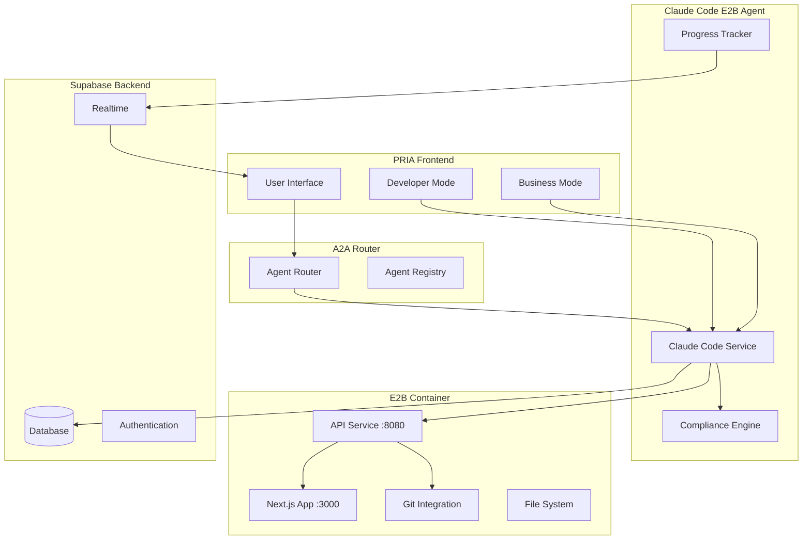

# PRIA-Claude Code E2B Integration Plan

## 🎯 Executive Summary

This document outlines the integration of Claude Code E2B into the PRIA ecosystem, providing both non-technical users and developers with an AI-powered application development environment that strictly enforces PRIA's enterprise-grade architectural standards.

## 🏗️ Integration Architecture

### High-Level System Design



### User Flow Architecture

#### **Phase 0: User Entry & Mode Selection**
```
User Login → Workspace Context → Mode Selection
                                      ↓
                            [Business User] or [Developer]
```

#### **Phase 1: Requirements Discovery (Both Modes)**
```
Conversational Interface → Requirement Extraction → Specification Confirmation
                                                           ↓
                                              Technical Specification Generation
```

#### **Phase 2: Development Process**

**Business User Mode:**
```
Auto-Generation → Progress Updates → Live Preview → Approval Gates → Deployment
```

**Developer Mode:**
```
Auto-Generation → Code Review → Interactive Editing → Testing → Git Integration → Deployment
```

## 👥 User Experience Design

### **Dual-Mode Interface**

#### **Business User Mode**
- **Focus**: Conversational, visual, approval-based
- **Interface**: Chat-driven requirement gathering
- **Visibility**: Progress tracking, live previews, high-level architecture
- **Controls**: Approve/reject, request changes, specification refinement
- **Technical Access**: None (abstracted away)

#### **Developer Mode**
- **Focus**: Full development environment access
- **Interface**: Code editor, file browser, terminal, git interface
- **Visibility**: Complete codebase, build logs, test results
- **Controls**: Direct code editing, git operations, deployment controls
- **Technical Access**: Full (with PRIA compliance guardrails)

### **Multi-Phase User Journey**

#### **Phase 1: Discovery & Planning**
1. **Initial Conversation**
   - AI asks clarifying questions about the application
   - Iteratively refines understanding of requirements
   - Identifies core entities, workflows, and user personas

2. **Specification Review**
   - Presents comprehensive technical specification
   - Allows user feedback and refinement
   - Confirms scope and technical approach

#### **Phase 2: Development**
1. **Environment Setup**
   - Creates E2B sandbox with PRIA-compliant baseline
   - Initializes git repository
   - Sets up development environment

2. **Code Generation**
   - Generates application following PRIA guidelines
   - Implements workspace tenancy and security patterns
   - Creates database schema with proper RLS

3. **Quality Assurance**
   - Runs automated compliance validation
   - Executes test suite
   - Performs security scanning

#### **Phase 3: Review & Deployment**
1. **User Review**
   - Presents live preview of application
   - Allows testing and feedback
   - Business users: High-level approval process
   - Developers: Detailed code review capability

2. **Iterative Refinement**
   - Processes user feedback
   - Makes targeted improvements
   - Re-validates compliance and quality

3. **Deployment**
   - Creates git repository and branches
   - Generates deployment-ready code
   - Provides integration instructions

## 🔧 Technical Implementation

### **A2A Agent Registration**

```typescript
// Agent capability registration
const claudeCodeAgent = {
  agent_name: 'claude-code-e2b',
  capabilities: [
    'app-generation',
    'code-editing',
    'requirement-analysis',
    'compliance-validation',
    'testing-automation'
  ],
  endpoint_url: 'https://claude-code-e2b.agents.pria.ai',
  schema_version: '1.0.0'
}
```

### **Supabase Integration Schema**

```sql
-- Claude Code specific tables
CREATE TABLE claude_sessions (
    id UUID PRIMARY KEY DEFAULT gen_random_uuid(),
    workspace_id UUID NOT NULL REFERENCES workspace(id),
    user_id UUID NOT NULL,
    mode TEXT NOT NULL CHECK (mode IN ('business', 'developer')),
    status TEXT NOT NULL CHECK (status IN ('discovering', 'planning', 'generating', 'reviewing', 'completed')),
    requirements JSONB,
    specification JSONB,
    e2b_sandbox_id TEXT,
    e2b_sandbox_url TEXT,
    git_repository_url TEXT,
    created_at TIMESTAMPTZ DEFAULT now(),
    updated_at TIMESTAMPTZ DEFAULT now()
);

CREATE TABLE claude_progress_events (
    id BIGSERIAL PRIMARY KEY,
    session_id UUID NOT NULL REFERENCES claude_sessions(id),
    workspace_id UUID NOT NULL REFERENCES workspace(id),
    event_type TEXT NOT NULL,
    event_data JSONB,
    created_at TIMESTAMPTZ DEFAULT now()
);

-- Row-Level Security
ALTER TABLE claude_sessions ENABLE ROW LEVEL SECURITY;
ALTER TABLE claude_progress_events ENABLE ROW LEVEL SECURITY;

CREATE POLICY "workspace_isolation" ON claude_sessions
FOR ALL USING (workspace_id = (jwt.claims->>'workspace_id')::uuid);

CREATE POLICY "workspace_isolation" ON claude_progress_events  
FOR ALL USING (workspace_id = (jwt.claims->>'workspace_id')::uuid);
```

### **Compliance Validation Engine**

```typescript
class PRIAComplianceEngine {
  async validateCode(files: GeneratedFile[]): Promise<ComplianceResult> {
    const violations: ComplianceViolation[] = []
    
    for (const file of files) {
      // Check workspace tenancy
      if (file.filePath.includes('supabase') && file.content.includes('.from(')) {
        if (!file.content.includes('workspace_id')) {
          violations.push({
            type: 'TENANCY_VIOLATION',
            file: file.filePath,
            message: 'Missing workspace_id filter in database query'
          })
        }
      }
      
      // Check for hardcoded secrets
      if (this.containsSecrets(file.content)) {
        violations.push({
          type: 'SECURITY_VIOLATION',
          file: file.filePath,
          message: 'Hardcoded secrets detected'
        })
      }
      
      // Validate required patterns
      if (file.filePath === 'middleware.ts' && !this.hasAuthMiddleware(file.content)) {
        violations.push({
          type: 'ARCHITECTURE_VIOLATION',
          file: file.filePath,
          message: 'Missing authentication middleware'
        })
      }
    }
    
    return {
      isCompliant: violations.length === 0,
      violations,
      score: this.calculateComplianceScore(violations)
    }
  }
}
```

### **Progress Tracking System**

```typescript
class ProgressTracker {
  async updateProgress(sessionId: string, event: ProgressEvent) {
    // Update database
    await supabase
      .from('claude_progress_events')
      .insert({
        session_id: sessionId,
        workspace_id: event.workspaceId,
        event_type: event.type,
        event_data: event.data
      })
    
    // Broadcast real-time update
    await supabase
      .channel(`progress:${sessionId}`)
      .send({
        type: 'broadcast',
        event: event.type,
        payload: event.data
      })
  }
}
```

## 🎨 Frontend Integration

### **React Components Architecture**

```typescript
// Main Claude Code Interface
export function ClaudeCodeInterface({ mode }: { mode: 'business' | 'developer' }) {
  if (mode === 'business') {
    return <BusinessUserInterface />
  }
  return <DeveloperInterface />
}

// Business User Interface
function BusinessUserInterface() {
  return (
    <div className="grid grid-cols-1 lg:grid-cols-3 gap-6">
      <div className="lg:col-span-2">
        <RequirementChat />
      </div>
      <div>
        <ProgressSidebar />
        <LivePreview />
      </div>
    </div>
  )
}

// Developer Interface  
function DeveloperInterface() {
  return (
    <div className="grid grid-cols-1 lg:grid-cols-4 gap-6">
      <div>
        <FileExplorer />
        <GitPanel />
      </div>
      <div className="lg:col-span-2">
        <CodeEditor />
        <Terminal />
      </div>
      <div>
        <ClaudeChat />
        <BuildStatus />
      </div>
    </div>
  )
}
```

### **Real-time Updates Integration**

```typescript
export function useClaudeSession(sessionId: string) {
  const [progress, setProgress] = useState<ProgressEvent[]>([])
  const [status, setStatus] = useState<SessionStatus>('discovering')
  
  useEffect(() => {
    const channel = supabase
      .channel(`progress:${sessionId}`)
      .on('broadcast', { event: '*' }, (payload) => {
        setProgress(prev => [...prev, payload])
        
        if (payload.event === 'status_change') {
          setStatus(payload.data.status)
        }
      })
      .subscribe()
    
    return () => {
      supabase.removeChannel(channel)
    }
  }, [sessionId])
  
  return { progress, status }
}
```

## 🚀 Deployment Strategy

### **Phase 1: Core Integration (Weeks 1-2)**
- [ ] Implement A2A agent registration
- [ ] Create PRIA compliance validation engine
- [ ] Set up Supabase schema and real-time channels
- [ ] Build basic dual-mode interface

### **Phase 2: User Experience (Weeks 3-4)**
- [ ] Implement conversational requirement gathering
- [ ] Build progress tracking and live preview
- [ ] Create developer mode code editor
- [ ] Add git integration interface

### **Phase 3: Advanced Features (Weeks 5-6)**
- [ ] Implement iterative refinement capabilities
- [ ] Add automated testing integration
- [ ] Build deployment pipeline integration
- [ ] Create comprehensive error handling

### **Phase 4: Production Readiness (Weeks 7-8)**
- [ ] Performance optimization
- [ ] Security hardening
- [ ] Load testing and scaling
- [ ] Documentation and training materials

## 📊 Success Metrics

### **Technical Metrics**
- **Compliance Score**: >95% PRIA architectural compliance
- **Generation Speed**: <5 minutes for typical applications
- **Success Rate**: >90% successful generation without manual intervention
- **Security Score**: Zero critical security vulnerabilities

### **User Experience Metrics**
- **Time to First App**: <30 minutes from start to live preview
- **User Satisfaction**: >4.5/5 rating
- **Iteration Cycles**: <3 average refinement cycles per app
- **Adoption Rate**: >70% of eligible projects use Claude Code

### **Business Metrics**
- **Development Speed**: 10x faster than manual development
- **Cost Reduction**: 80% reduction in development costs
- **Quality Improvement**: 50% fewer post-deployment bugs
- **Developer Satisfaction**: >80% prefer Claude Code for new projects

## 🔒 Security & Compliance

### **Data Classification**
All generated code and user interactions are classified as:
- **Internal (I)**: Development artifacts and code
- **Confidential (C)**: User requirements and business logic
- **Restricted (R)**: Authentication tokens and API keys

### **Audit Trail**
Complete audit logging of:
- User interactions and requests
- Code generation events
- Compliance validation results
- Deployment activities
- Access patterns and permissions

### **Privacy Protection**
- No user data stored outside PRIA infrastructure
- End-to-end encryption for sensitive communications
- Automatic data retention and purging policies
- GDPR and SOC2 compliance maintained

## 🎯 Next Steps

1. **Technical Foundation**
   - Set up E2B template with enhanced Claude Code integration
   - Implement A2A agent registration and Supabase schema
   - Create PRIA compliance validation engine

2. **User Interface Development**
   - Build dual-mode interface components
   - Implement real-time progress tracking
   - Create conversational requirement gathering system

3. **Integration Testing**
   - Test with existing PRIA infrastructure
   - Validate compliance engine accuracy
   - Performance testing with realistic workloads

4. **Pilot Program**
   - Deploy to limited user group
   - Gather feedback and iterate
   - Refine user experience based on real usage

This integration plan provides a comprehensive roadmap for bringing enterprise-grade AI-powered development to PRIA users while maintaining the platform's high standards for security, compliance, and user experience.