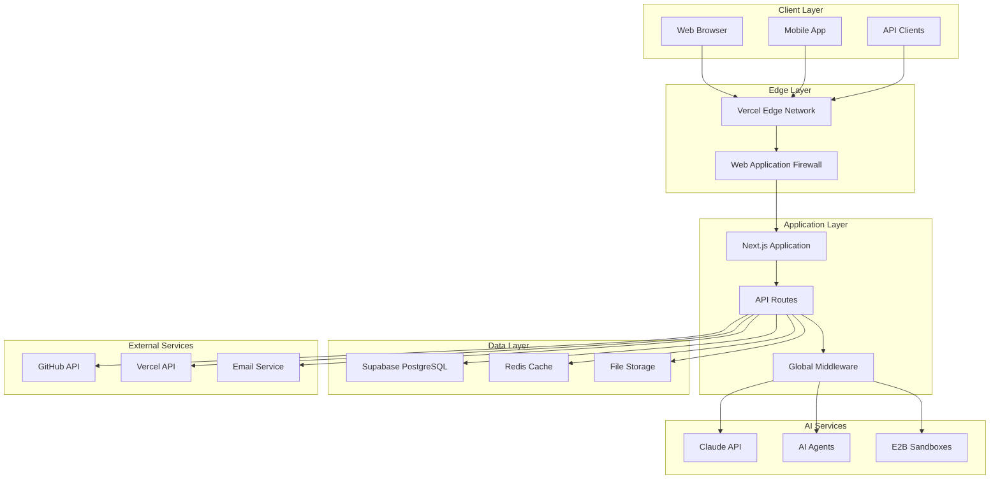
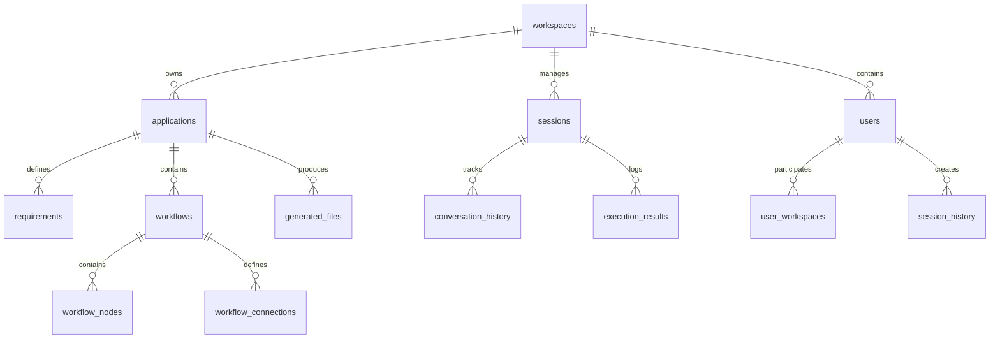
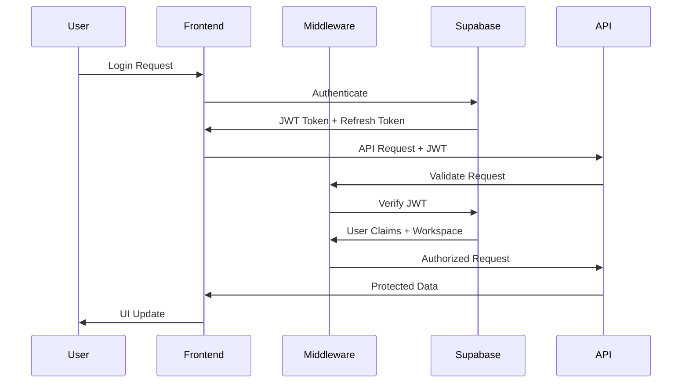

# PRIA Platform Technical Architecture

This document provides a comprehensive technical overview of the Platform for Rapid Intelligent Applications (PRIA), covering system design, component architecture, data flow, and infrastructure patterns.

## 📋 Table of Contents

1. [System Overview](#system-overview)
2. [Architecture Patterns](#architecture-patterns)
3. [Core Components](#core-components)
4. [Data Architecture](#data-architecture)
5. [Security Architecture](#security-architecture)
6. [Infrastructure & Deployment](#infrastructure--deployment)
7. [AI Integration](#ai-integration)
8. [Performance & Scaling](#performance--scaling)
9. [Monitoring & Observability](#monitoring--observability)
10. [Development Workflow](#development-workflow)

## 🏗️ System Overview

### High-Level Architecture



### Technology Stack

#### **Frontend Stack**
```typescript
{
  "framework": "Next.js 15 (App Router)",
  "ui_library": "React 19",
  "language": "TypeScript",
  "styling": "Tailwind CSS 4.x",
  "components": "Radix UI + shadcn/ui",
  "icons": "Lucide React",
  "animations": "Framer Motion",
  "state_management": "Zustand",
  "forms": "React Hook Form + Zod",
  "testing": "Vitest + React Testing Library"
}
```

#### **Backend Stack**
```typescript
{
  "runtime": "Node.js 20+",
  "framework": "Next.js API Routes",
  "database": "PostgreSQL (Supabase)",
  "auth": "Supabase Auth (JWT)",
  "orm": "Supabase JavaScript Client",
  "caching": "Redis (Upstash)",
  "logging": "Pino",
  "validation": "Zod",
  "testing": "Vitest + Supertest"
}
```

#### **Infrastructure Stack**
```typescript
{
  "hosting": "Vercel (Serverless)",
  "database": "Supabase (Managed PostgreSQL)",
  "cdn": "Vercel Edge Network",
  "monitoring": "Custom + Vercel Analytics",
  "ci_cd": "GitHub Actions",
  "containerization": "Docker (E2B)",
  "secrets": "Vercel Environment Variables"
}
```

## 🏛️ Architecture Patterns

### Multi-Tenant SaaS Architecture

PRIA implements a **shared database, separate schema** multi-tenancy pattern:

```sql
-- Every table includes workspace isolation
CREATE TABLE applications (
    id UUID PRIMARY KEY DEFAULT gen_random_uuid(),
    workspace_id UUID NOT NULL REFERENCES workspaces(id),
    name VARCHAR(255) NOT NULL,
    -- ... other fields
    created_at TIMESTAMPTZ DEFAULT NOW()
);

-- Row-Level Security enforces tenant isolation
CREATE POLICY "workspace_isolation" ON applications
FOR ALL USING (workspace_id = (auth.jwt() ->> 'workspace_id')::uuid);
```

#### Tenant Isolation Benefits
- **Data Security**: Complete data isolation between workspaces
- **Performance**: Shared infrastructure with optimal resource utilization
- **Scalability**: Easy horizontal scaling across tenant boundaries
- **Cost Efficiency**: Shared resources reduce infrastructure costs

### Microservices Architecture

PRIA follows a modular microservices pattern within the Next.js monolith:

```typescript
// Service Layer Organization
src/
├── lib/
│   ├── auth/              # Authentication service
│   ├── claude-sdk/        # AI integration service
│   ├── e2b-integration/   # Sandbox service
│   ├── github-integration/# Version control service
│   ├── deployment/        # Deployment service
│   ├── monitoring/        # Observability service
│   └── rate-limiting/     # Rate limiting service
```

#### Service Communication Patterns
- **Synchronous**: Direct function calls within the monolith
- **Asynchronous**: Event-driven patterns for background tasks
- **External**: HTTP/REST APIs for third-party integrations

### Event-Driven Architecture

```typescript
// Event System for Asynchronous Operations
interface PlatformEvent {
  type: string
  payload: any
  metadata: {
    timestamp: Date
    source: string
    traceId: string
  }
}

// Example Events
export const Events = {
  APPLICATION_CREATED: 'application.created',
  DEPLOYMENT_STARTED: 'deployment.started',
  CODE_GENERATED: 'code.generated',
  USER_INVITED: 'user.invited'
} as const
```

## 🧩 Core Components

### Authentication & Authorization

#### JWT-Based Authentication
```typescript
// JWT Token Structure
interface JWTPayload {
  sub: string              // User ID
  email: string           // User email
  workspace_id: string    // Tenant identifier
  role: 'owner' | 'admin' | 'developer' | 'viewer'
  iss: string             // Issuer (Supabase)
  exp: number             // Expiration timestamp
}
```

#### Role-Based Access Control (RBAC)
```typescript
// Permission Matrix
const PERMISSIONS = {
  'workspace:read': ['owner', 'admin', 'developer', 'viewer'],
  'workspace:write': ['owner', 'admin'],
  'application:create': ['owner', 'admin', 'developer'],
  'application:deploy': ['owner', 'admin'],
  'user:invite': ['owner', 'admin'],
  'billing:manage': ['owner']
} as const
```

### AI Integration Layer

#### Claude SDK Integration
```typescript
export class ClaudeSDKAgent {
  private claudeSDK: ClaudeCodeSDK
  
  async executeOperation(operation: AIOperation): Promise<AIResult> {
    // Validate operation
    const validation = this.validateOperation(operation)
    if (!validation.valid) {
      throw new Error(`Invalid operation: ${validation.errors.join(', ')}`)
    }
    
    // Execute with Claude SDK
    const result = await this.claudeSDK.run({
      command: operation.command,
      context: operation.context,
      timeout: operation.timeout || 30000
    })
    
    // Process and validate result
    return this.processResult(result)
  }
}
```

#### E2B Sandbox Management
```typescript
export class E2BSandboxManager {
  async createSandbox(config: SandboxConfig): Promise<Sandbox> {
    const sandbox = await E2B.create({
      template: config.template || 'node',
      timeout: config.timeout || 300000,
      metadata: {
        workspace_id: config.workspace_id,
        session_id: config.session_id
      }
    })
    
    // Register sandbox for cleanup
    this.registerSandbox(sandbox.id, config)
    
    return sandbox
  }
  
  async executecode(sandboxId: string, code: string): Promise<ExecutionResult> {
    const sandbox = await this.getSandbox(sandboxId)
    return await sandbox.execute(code)
  }
}
```

### Data Access Layer

#### Repository Pattern Implementation
```typescript
// Base Repository with Tenant Isolation
export abstract class BaseRepository<T> {
  protected tableName: string
  protected supabase: SupabaseClient
  
  async findByWorkspace(workspaceId: string): Promise<T[]> {
    const { data, error } = await this.supabase
      .from(this.tableName)
      .select('*')
      .eq('workspace_id', workspaceId)
    
    if (error) throw new DatabaseError(error.message)
    return data
  }
  
  async create(data: Omit<T, 'id' | 'created_at'>): Promise<T> {
    const { data: result, error } = await this.supabase
      .from(this.tableName)
      .insert(data)
      .select()
      .single()
    
    if (error) throw new DatabaseError(error.message)
    return result
  }
}

// Specific Repository Implementation
export class ApplicationRepository extends BaseRepository<Application> {
  protected tableName = 'applications'
  
  async findByName(workspaceId: string, name: string): Promise<Application | null> {
    const { data, error } = await this.supabase
      .from(this.tableName)
      .select('*')
      .eq('workspace_id', workspaceId)
      .eq('name', name)
      .single()
    
    if (error && error.code !== 'PGRST116') {
      throw new DatabaseError(error.message)
    }
    
    return data
  }
}
```

### API Layer Architecture

#### Middleware Stack
```typescript
// Global Middleware Pipeline
export async function middleware(request: NextRequest) {
  const response = NextResponse.next()
  
  // 1. Security Headers
  addSecurityHeaders(response)
  
  // 2. Rate Limiting
  const rateLimitResult = await applyRateLimit(request)
  if (!rateLimitResult.allowed) {
    return createRateLimitResponse(rateLimitResult)
  }
  
  // 3. Authentication
  if (isProtectedRoute(request.nextUrl.pathname)) {
    const authResult = await authenticateRequest(request)
    if (!authResult.success) {
      return createAuthErrorResponse(authResult)
    }
    
    // Add user context to request
    response.headers.set('x-user-id', authResult.user.id)
    response.headers.set('x-workspace-id', authResult.user.workspace_id)
  }
  
  // 4. Request Logging
  logRequest(request, response)
  
  return response
}
```

#### API Route Structure
```typescript
// Standardized API Route Pattern
export async function POST(request: NextRequest) {
  try {
    // 1. Authentication & Authorization
    const auth = await authenticateRequest(request)
    if (!auth.success) {
      return NextResponse.json({ error: 'Unauthorized' }, { status: 401 })
    }
    
    // 2. Input Validation
    const body = await request.json()
    const validatedData = CreateApplicationSchema.parse(body)
    
    // 3. Business Logic
    const applicationService = new ApplicationService(auth.user.workspace_id)
    const application = await applicationService.create(validatedData)
    
    // 4. Response
    return NextResponse.json({
      success: true,
      data: application
    }, { status: 201 })
    
  } catch (error) {
    return handleAPIError(error)
  }
}
```

## 💾 Data Architecture

### Database Schema Design

#### Core Entity Relationships


#### Workspace Schema
```sql
-- Multi-tenant workspace structure
CREATE TABLE workspaces (
    id UUID PRIMARY KEY DEFAULT gen_random_uuid(),
    name VARCHAR(255) NOT NULL,
    slug VARCHAR(100) UNIQUE NOT NULL,
    settings JSONB DEFAULT '{}',
    subscription_tier VARCHAR(50) DEFAULT 'free',
    created_at TIMESTAMPTZ DEFAULT NOW(),
    updated_at TIMESTAMPTZ DEFAULT NOW()
);

-- User-workspace relationship with roles
CREATE TABLE user_workspaces (
    id UUID PRIMARY KEY DEFAULT gen_random_uuid(),
    user_id UUID NOT NULL REFERENCES auth.users(id),
    workspace_id UUID NOT NULL REFERENCES workspaces(id),
    role VARCHAR(20) NOT NULL CHECK (role IN ('owner', 'admin', 'developer', 'viewer')),
    invited_by UUID REFERENCES auth.users(id),
    joined_at TIMESTAMPTZ DEFAULT NOW(),
    UNIQUE(user_id, workspace_id)
);
```

#### Application Schema
```sql
-- Application metadata and configuration
CREATE TABLE applications (
    id UUID PRIMARY KEY DEFAULT gen_random_uuid(),
    workspace_id UUID NOT NULL REFERENCES workspaces(id),
    name VARCHAR(255) NOT NULL,
    description TEXT,
    type VARCHAR(50) DEFAULT 'web_app',
    framework VARCHAR(50) DEFAULT 'nextjs',
    status VARCHAR(20) DEFAULT 'draft',
    configuration JSONB DEFAULT '{}',
    created_by UUID NOT NULL REFERENCES auth.users(id),
    created_at TIMESTAMPTZ DEFAULT NOW(),
    updated_at TIMESTAMPTZ DEFAULT NOW(),
    UNIQUE(workspace_id, name)
);

-- Generated code and files
CREATE TABLE generated_files (
    id UUID PRIMARY KEY DEFAULT gen_random_uuid(),
    workspace_id UUID NOT NULL REFERENCES workspaces(id),
    application_id UUID NOT NULL REFERENCES applications(id),
    session_id UUID REFERENCES sessions(id),
    file_path VARCHAR(500) NOT NULL,
    content TEXT NOT NULL,
    language VARCHAR(50),
    size_bytes INTEGER,
    checksum VARCHAR(64),
    created_at TIMESTAMPTZ DEFAULT NOW(),
    updated_at TIMESTAMPTZ DEFAULT NOW()
);
```

### Data Access Patterns

#### Repository Pattern with Caching
```typescript
export class CachedRepository<T> extends BaseRepository<T> {
  private cache: Redis
  private cacheTTL: number = 300 // 5 minutes
  
  async findById(id: string, workspaceId: string): Promise<T | null> {
    // Check cache first
    const cacheKey = `${this.tableName}:${workspaceId}:${id}`
    const cached = await this.cache.get(cacheKey)
    if (cached) {
      return JSON.parse(cached)
    }
    
    // Fetch from database
    const result = await super.findById(id, workspaceId)
    
    // Cache the result
    if (result) {
      await this.cache.setex(cacheKey, this.cacheTTL, JSON.stringify(result))
    }
    
    return result
  }
}
```

#### Connection Pool Management
```typescript
// Supabase connection configuration
const supabaseConfig = {
  auth: {
    persistSession: false,
    detectSessionInUrl: false
  },
  db: {
    pool: {
      min: 5,
      max: 20,
      idleTimeoutMillis: 30000,
      connectionTimeoutMillis: 2000
    }
  }
}
```

## 🔒 Security Architecture

### Defense in Depth Strategy

#### Layer 1: Edge Security
```typescript
// Vercel Edge Functions for security
export default function middleware(request: NextRequest) {
  // Rate limiting at edge
  const rateLimitHeaders = {
    'X-RateLimit-Limit': '100',
    'X-RateLimit-Remaining': '99',
    'X-RateLimit-Reset': Date.now() + 60000
  }
  
  // Security headers
  const securityHeaders = {
    'X-Frame-Options': 'DENY',
    'X-Content-Type-Options': 'nosniff',
    'Referrer-Policy': 'strict-origin-when-cross-origin',
    'Permissions-Policy': 'camera=(), microphone=(), geolocation=()'
  }
  
  return NextResponse.next({
    headers: { ...rateLimitHeaders, ...securityHeaders }
  })
}
```

#### Layer 2: Application Security
```typescript
// Input validation and sanitization
export const CreateApplicationSchema = z.object({
  name: z.string()
    .min(1, 'Name is required')
    .max(100, 'Name too long')
    .regex(/^[a-zA-Z0-9-_\s]+$/, 'Invalid characters'),
  description: z.string()
    .max(500, 'Description too long')
    .optional(),
  type: z.enum(['web_app', 'api', 'mobile']),
  configuration: z.record(z.any()).default({})
})

// SQL injection prevention through parameterized queries
const { data, error } = await supabase
  .from('applications')
  .select('*')
  .eq('workspace_id', workspaceId)  // Parameterized
  .eq('name', applicationName)      // Parameterized
```

#### Layer 3: Database Security
```sql
-- Row-Level Security (RLS) policies
ALTER TABLE applications ENABLE ROW LEVEL SECURITY;

-- Users can only access their workspace data
CREATE POLICY "workspace_access" ON applications
FOR ALL USING (
    workspace_id IN (
        SELECT workspace_id 
        FROM user_workspaces 
        WHERE user_id = auth.uid()
    )
);

-- Role-based access for sensitive operations
CREATE POLICY "admin_write_access" ON applications
FOR INSERT WITH CHECK (
    EXISTS (
        SELECT 1 FROM user_workspaces 
        WHERE user_id = auth.uid() 
        AND workspace_id = applications.workspace_id
        AND role IN ('owner', 'admin')
    )
);
```

### Authentication Flow



### Secrets Management

```typescript
// Environment-based secrets management
const secrets = {
  database: {
    url: process.env.SUPABASE_URL!,
    key: process.env.SUPABASE_SERVICE_ROLE_KEY!
  },
  ai: {
    claudeKey: process.env.ANTHROPIC_API_KEY!,
    e2bKey: process.env.E2B_API_KEY!
  },
  integrations: {
    githubClientId: process.env.GITHUB_CLIENT_ID!,
    githubClientSecret: process.env.GITHUB_CLIENT_SECRET!,
    vercelToken: process.env.VERCEL_TOKEN!
  }
}

// Runtime validation
const secretsSchema = z.object({
  SUPABASE_URL: z.string().url(),
  ANTHROPIC_API_KEY: z.string().startsWith('sk-'),
  GITHUB_CLIENT_ID: z.string().length(20),
  // ... other validations
})

secretsSchema.parse(process.env)
```

## 🏗️ Infrastructure & Deployment

### Serverless Architecture

#### Vercel Deployment Configuration
```typescript
// vercel.json
{
  "framework": "nextjs",
  "buildCommand": "npm run build",
  "functions": {
    "app/api/**/*.ts": {
      "maxDuration": 30
    },
    "app/api/claude/**/*.ts": {
      "maxDuration": 60
    },
    "app/api/deploy/**/*.ts": {
      "maxDuration": 300
    }
  },
  "crons": [
    {
      "path": "/api/cron/cleanup",
      "schedule": "0 2 * * *"
    }
  ]
}
```

#### Docker Configuration for E2B
```dockerfile
# E2B Sandbox Template
FROM node:20-alpine

# Install system dependencies
RUN apk add --no-cache \
    git \
    python3 \
    make \
    g++ \
    bash

# Set working directory
WORKDIR /code

# Install Node.js dependencies
COPY package*.json ./
RUN npm ci

# Copy application code
COPY . .

# Build application
RUN npm run build

# Expose port
EXPOSE 3000

# Health check
HEALTHCHECK --interval=30s --timeout=3s --start-period=5s --retries=3 \
  CMD curl -f http://localhost:3000/api/health || exit 1

# Start command
CMD ["npm", "start"]
```

### CI/CD Pipeline

```yaml
# .github/workflows/deploy.yml
name: Deploy to Vercel

on:
  push:
    branches: [main, develop]
  pull_request:
    branches: [main]

jobs:
  test:
    runs-on: ubuntu-latest
    steps:
      - uses: actions/checkout@v4
      - uses: actions/setup-node@v4
        with:
          node-version: '20'
          cache: 'npm'
      
      - run: npm ci
      - run: npm run lint
      - run: npm run type-check
      - run: npm run test
      - run: npm run build

  deploy-preview:
    if: github.event_name == 'pull_request'
    needs: test
    runs-on: ubuntu-latest
    steps:
      - uses: actions/checkout@v4
      - uses: amondnet/vercel-action@v25
        with:
          vercel-token: ${{ secrets.VERCEL_TOKEN }}
          vercel-org-id: ${{ secrets.VERCEL_ORG_ID }}
          vercel-project-id: ${{ secrets.VERCEL_PROJECT_ID }}

  deploy-production:
    if: github.ref == 'refs/heads/main'
    needs: test
    runs-on: ubuntu-latest
    steps:
      - uses: actions/checkout@v4
      - uses: amondnet/vercel-action@v25
        with:
          vercel-token: ${{ secrets.VERCEL_TOKEN }}
          vercel-org-id: ${{ secrets.VERCEL_ORG_ID }}
          vercel-project-id: ${{ secrets.VERCEL_PROJECT_ID }}
          vercel-args: '--prod'
```

## 🤖 AI Integration

### Claude SDK Architecture

```typescript
// AI Operation Management
export class AIOperationManager {
  private operations: Map<string, AIOperation> = new Map()
  private results: Map<string, AIResult> = new Map()
  
  async executeOperation(
    type: AIOperationType,
    context: AIContext,
    options: AIOptions = {}
  ): Promise<AIResult> {
    const operationId = generateOperationId()
    
    const operation: AIOperation = {
      id: operationId,
      type,
      context,
      options,
      status: 'pending',
      startTime: Date.now()
    }
    
    this.operations.set(operationId, operation)
    
    try {
      // Execute based on operation type
      const result = await this.executeByType(operation)
      
      operation.status = 'completed'
      operation.endTime = Date.now()
      operation.result = result
      
      this.results.set(operationId, result)
      
      return result
    } catch (error) {
      operation.status = 'failed'
      operation.error = error
      
      throw new AIOperationError(`Operation ${operationId} failed`, error)
    }
  }
  
  private async executeByType(operation: AIOperation): Promise<AIResult> {
    switch (operation.type) {
      case 'code_generation':
        return await this.executeCodeGeneration(operation)
      case 'code_review':
        return await this.executeCodeReview(operation)
      case 'debugging':
        return await this.executeDebugging(operation)
      case 'optimization':
        return await this.executeOptimization(operation)
      default:
        throw new Error(`Unknown operation type: ${operation.type}`)
    }
  }
}
```

### E2B Sandbox Integration

```typescript
// Sandbox Lifecycle Management
export class SandboxLifecycleManager {
  private activeSandboxes: Map<string, SandboxInstance> = new Map()
  private sandboxMetrics: Map<string, SandboxMetrics> = new Map()
  
  async createSandbox(config: SandboxConfig): Promise<SandboxInstance> {
    // Resource allocation check
    await this.checkResourceAvailability(config)
    
    // Create E2B sandbox
    const sandbox = await E2B.create({
      template: config.template,
      metadata: {
        workspace_id: config.workspaceId,
        session_id: config.sessionId,
        created_at: new Date().toISOString()
      }
    })
    
    // Initialize sandbox environment
    await this.initializeSandbox(sandbox, config)
    
    // Register for monitoring
    this.registerSandbox(sandbox)
    
    return sandbox
  }
  
  private async initializeSandbox(
    sandbox: SandboxInstance, 
    config: SandboxConfig
  ): Promise<void> {
    // Install dependencies
    if (config.dependencies) {
      await sandbox.run(`npm install ${config.dependencies.join(' ')}`)
    }
    
    // Setup environment variables
    if (config.environment) {
      const envVars = Object.entries(config.environment)
        .map(([key, value]) => `export ${key}="${value}"`)
        .join('\n')
      
      await sandbox.writeFile('.env', envVars)
    }
    
    // Initialize project structure
    if (config.template === 'nextjs') {
      await this.initializeNextJSProject(sandbox)
    }
  }
}
```

## 📈 Performance & Scaling

### Caching Strategy

```typescript
// Multi-Layer Caching
export class CacheManager {
  private memoryCache: Map<string, CacheEntry> = new Map()
  private redisCache: Redis
  private cdnCache: CDNClient
  
  async get<T>(key: string): Promise<T | null> {
    // L1: Memory cache (fastest)
    const memoryResult = this.memoryCache.get(key)
    if (memoryResult && !this.isExpired(memoryResult)) {
      return memoryResult.data as T
    }
    
    // L2: Redis cache (fast)
    const redisResult = await this.redisCache.get(key)
    if (redisResult) {
      const data = JSON.parse(redisResult)
      this.setMemoryCache(key, data, 60) // 1 minute memory cache
      return data as T
    }
    
    // L3: CDN cache (for static content)
    if (this.isStaticContent(key)) {
      return await this.cdnCache.get(key)
    }
    
    return null
  }
  
  async set<T>(
    key: string, 
    value: T, 
    ttl: number = 300
  ): Promise<void> {
    // Set in all cache layers
    this.setMemoryCache(key, value, Math.min(ttl, 60))
    await this.redisCache.setex(key, ttl, JSON.stringify(value))
    
    if (this.isStaticContent(key)) {
      await this.cdnCache.set(key, value, ttl)
    }
  }
}
```

### Database Optimization

```typescript
// Connection Pool Management
export class DatabaseManager {
  private connectionPool: Pool
  private readReplicas: Pool[]
  private writeConnection: Pool
  
  constructor() {
    this.connectionPool = new Pool({
      min: 5,
      max: 20,
      idleTimeoutMillis: 30000,
      connectionTimeoutMillis: 2000,
      acquireTimeoutMillis: 60000
    })
    
    // Read replicas for read-heavy operations
    this.readReplicas = this.createReadReplicas()
  }
  
  async executeQuery<T>(
    query: string, 
    params: any[], 
    options: QueryOptions = {}
  ): Promise<T> {
    const pool = options.readOnly 
      ? this.getReadReplica()
      : this.writeConnection
    
    const startTime = performance.now()
    
    try {
      const result = await pool.query(query, params)
      
      // Log slow queries
      const duration = performance.now() - startTime
      if (duration > 1000) {
        logger.warn('Slow query detected', { query, duration, params })
      }
      
      return result.rows as T
    } catch (error) {
      logger.error('Database query failed', { query, params, error })
      throw new DatabaseError('Query execution failed', error)
    }
  }
}
```

### Auto-Scaling Configuration

```typescript
// Vercel Function Scaling
export const scalingConfig = {
  functions: {
    'app/api/claude/**': {
      maxDuration: 60,
      memory: 1024,
      regions: ['iad1', 'sfo1', 'fra1']
    },
    'app/api/e2b/**': {
      maxDuration: 30,
      memory: 512,
      regions: ['iad1', 'sfo1']
    }
  },
  
  // Edge caching
  headers: [
    {
      source: '/api/health',
      headers: [
        {
          key: 'Cache-Control',
          value: 'public, max-age=60, stale-while-revalidate=300'
        }
      ]
    }
  ]
}
```

## 📊 Monitoring & Observability

### Comprehensive Logging

```typescript
// Structured Logging with Context
export class Logger {
  private pino: pino.Logger
  
  constructor() {
    this.pino = pino({
      level: process.env.LOG_LEVEL || 'info',
      formatters: {
        level: (label) => ({ level: label }),
        bindings: (bindings) => ({
          pid: bindings.pid,
          hostname: bindings.hostname,
          environment: process.env.NODE_ENV
        })
      },
      timestamp: pino.stdTimeFunctions.isoTime
    })
  }
  
  logAPIRequest(
    method: string,
    url: string,
    statusCode: number,
    duration: number,
    userId?: string,
    workspaceId?: string
  ): void {
    this.pino.info({
      type: 'api_request',
      method,
      url,
      statusCode,
      duration,
      userId,
      workspaceId,
      timestamp: new Date().toISOString()
    })
  }
  
  logAIOperation(
    operationType: string,
    status: string,
    duration?: number,
    error?: Error
  ): void {
    this.pino.info({
      type: 'ai_operation',
      operationType,
      status,
      duration,
      error: error?.message,
      stack: error?.stack,
      timestamp: new Date().toISOString()
    })
  }
}
```

### Health Check System

```typescript
// Comprehensive Health Checks
export class HealthCheckService {
  async getSystemHealth(): Promise<HealthStatus> {
    const checks = await Promise.allSettled([
      this.checkDatabase(),
      this.checkRedis(),
      this.checkE2BService(),
      this.checkClaudeAPI(),
      this.checkGitHubAPI(),
      this.checkVercelAPI()
    ])
    
    const results = checks.map((check, index) => ({
      service: this.serviceNames[index],
      status: check.status === 'fulfilled' ? 'healthy' : 'unhealthy',
      details: check.status === 'fulfilled' 
        ? check.value 
        : { error: check.reason.message }
    }))
    
    const overallStatus = results.every(r => r.status === 'healthy')
      ? 'healthy'
      : results.some(r => r.status === 'healthy')
      ? 'degraded'
      : 'unhealthy'
    
    return {
      status: overallStatus,
      timestamp: new Date().toISOString(),
      services: results,
      version: process.env.npm_package_version,
      uptime: process.uptime()
    }
  }
}
```

## 🔄 Development Workflow

### Feature Development Flow

```mermaid
graph LR
    A[Feature Request] --> B[Requirements Analysis]
    B --> C[AI-Assisted Design]
    C --> D[Code Generation]
    D --> E[Local Testing]
    E --> F[Code Review]
    F --> G[Integration Testing]
    G --> H[Deployment Pipeline]
    H --> I[Production Monitoring]
    
    subgraph "AI Integration"
        C1[Claude Analysis]
        C2[Architecture Suggestions]
        C3[Code Generation]
        C4[Testing Strategy]
    end
    
    C --> C1
    C1 --> C2
    C2 --> C3
    C3 --> C4
    C4 --> D
```



### Code Quality Gates

```typescript
// Automated Quality Checks
export class QualityGateService {
  async runQualityGate(codebase: Codebase): Promise<QualityReport> {
    const checks = await Promise.all([
      this.runLinting(codebase),
      this.runTypeChecking(codebase),
      this.runSecurityScan(codebase),
      this.runPerformanceAnalysis(codebase),
      this.runTestCoverage(codebase)
    ])
    
    const passed = checks.every(check => check.passed)
    
    return {
      passed,
      checks,
      score: this.calculateQualityScore(checks),
      recommendations: this.generateRecommendations(checks)
    }
  }
}
```

### Deployment Strategy

```typescript
// Blue-Green Deployment with Canary Testing
export class DeploymentManager {
  async deployWithCanary(
    deployment: DeploymentConfig
  ): Promise<DeploymentResult> {
    // 1. Deploy to staging
    const stagingDeployment = await this.deployToStaging(deployment)
    
    // 2. Run integration tests
    const testResults = await this.runIntegrationTests(stagingDeployment)
    if (!testResults.passed) {
      throw new DeploymentError('Integration tests failed', testResults)
    }
    
    // 3. Deploy canary (5% traffic)
    const canaryDeployment = await this.deployCanary(deployment, 0.05)
    
    // 4. Monitor canary metrics
    const canaryMetrics = await this.monitorCanary(canaryDeployment, 300000) // 5 minutes
    
    // 5. Full deployment if canary successful
    if (canaryMetrics.errorRate < 0.01) {
      return await this.deployProduction(deployment)
    } else {
      await this.rollbackCanary(canaryDeployment)
      throw new DeploymentError('Canary deployment failed', canaryMetrics)
    }
  }
}
```

This technical architecture provides a solid foundation for building, scaling, and maintaining the PRIA platform while ensuring security, performance, and reliability at enterprise scale.