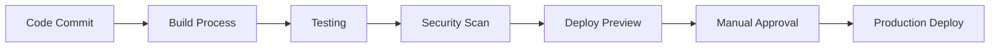

# PRIA Platform User Guide

A comprehensive guide to using the Platform for Rapid Intelligent Applications (PRIA) to transform your ideas into production-ready applications.

## 📋 Table of Contents

1. [Getting Started](#getting-started)
2. [Dashboard Overview](#dashboard-overview)
3. [Creating Your First Application](#creating-your-first-application)
4. [Working with Sessions](#working-with-sessions)
5. [Requirements Management](#requirements-management)
6. [Code Generation](#code-generation)
7. [Testing & Debugging](#testing--debugging)
8. [Deployment](#deployment)
9. [Collaboration](#collaboration)
10. [Best Practices](#best-practices)

## 🚀 Getting Started

### Account Setup

1. **Access the Platform**
   - Navigate to your PRIA instance URL
   - Click "Sign Up" or "Log In"

2. **Create Your Account**
   - Enter your email and password
   - Verify your email address
   - Complete your profile setup

3. **Workspace Creation**
   - Choose a workspace name (e.g., "My Company Apps")
   - Select your workspace settings
   - Invite team members (optional)

### First Login Experience

After successful authentication, you'll be redirected to the main dashboard where you can:
- View your existing applications
- Create new applications
- Access team workspaces
- Review recent activity

## 🏠 Dashboard Overview

### Main Navigation

The dashboard provides several key sections:

#### 📱 Applications
- **My Applications**: Your personal applications
- **Team Applications**: Shared team projects
- **Templates**: Pre-built application templates
- **Recently Modified**: Quick access to recent work

#### 🛠️ Development Tools
- **Sessions**: Active development sessions
- **Requirements**: Project specifications and goals
- **Code Editor**: Direct code editing interface
- **Testing Environment**: Sandbox for testing applications

#### 📊 Analytics & Monitoring
- **Usage Analytics**: Track application performance
- **Deployment Status**: Monitor deployment pipelines
- **System Health**: Platform health and status
- **Team Activity**: Collaborative development activity

#### ⚙️ Settings
- **Profile Settings**: Personal account settings
- **Workspace Settings**: Team and workspace configuration
- **Integration Settings**: External service connections
- **Billing & Usage**: Subscription and usage information

## 🎯 Creating Your First Application

### Step 1: Application Initialization

1. **Click "New Application"**
   - From the dashboard, click the "New Application" button
   - Choose "Start from Scratch" or select a template

2. **Application Details**
   ```
   Name: My Todo App
   Description: A simple task management application
   Type: Web Application
   Framework: Next.js (recommended)
   ```

3. **Initial Configuration**
   - Select deployment target (Vercel recommended)
   - Choose database requirements (Supabase included)
   - Set up authentication requirements

### Step 2: Requirements Gathering

Use the conversational interface to define your application:

```
Tell PRIA: "I want to create a todo application where users can:
- Add new tasks with due dates
- Mark tasks as complete
- Filter tasks by status
- Organize tasks by categories
- Share tasks with team members"
```

PRIA will analyze your requirements and suggest:
- Database schema design
- User interface components
- API endpoints needed
- Authentication requirements

### Step 3: Review & Confirm

- **Technical Specification**: Review the generated technical plan
- **Architecture Diagram**: Visualize the application structure
- **Timeline Estimate**: Understand development timeline
- **Resource Requirements**: Review computational needs

## 💼 Working with Sessions

### Understanding Sessions

Sessions are focused development environments where you work on specific features or components of your application.

### Creating a New Session

1. **Navigate to Sessions**
   - Click "Sessions" in the main navigation
   - Click "New Session"

2. **Session Configuration**
   ```
   Session Name: User Authentication
   Application: My Todo App
   Focus Area: Login/Registration System
   Duration: 2 hours (estimated)
   ```

3. **Session Environment**
   - **Code Editor**: Full-featured code editor with syntax highlighting
   - **Live Preview**: Real-time preview of your application
   - **AI Assistant**: Claude integration for coding help
   - **Terminal**: Command-line access for development tools

### Session Workflow

#### 1. Planning Phase
```
User: "I need to implement user registration with email verification"

PRIA Response: "I'll help you implement user registration. Here's what we'll build:
1. Registration form component
2. Email verification system
3. Database user model
4. API endpoints for registration
5. Email service integration

Let's start with the registration form. Should we use the existing design system?"
```

#### 2. Development Phase
- PRIA generates code based on your requirements
- You can modify and customize the generated code
- Real-time preview shows your changes
- AI assistant provides guidance and suggestions

#### 3. Testing Phase
- Test functionality in the live preview
- Run automated tests (if configured)
- Debug issues with AI assistance
- Validate against requirements

#### 4. Deployment Phase
- Review changes before deployment
- Deploy to preview environment
- Test in staging environment
- Deploy to production (when ready)

## 📋 Requirements Management

### Creating Requirements

Requirements in PRIA are structured specifications that guide application development.

#### Functional Requirements
```markdown
## User Authentication
- Users must be able to register with email and password
- Email verification is required before account activation
- Users can reset passwords via email
- Support for social login (Google, GitHub)

## Task Management
- Users can create, edit, and delete tasks
- Tasks have title, description, due date, and priority
- Tasks can be organized in categories/projects
- Users can mark tasks as complete/incomplete
```

#### Non-Functional Requirements
```markdown
## Performance
- Page load time < 2 seconds
- Support for 1000+ concurrent users
- 99.9% uptime SLA

## Security
- HTTPS encryption for all communications
- OWASP compliance for web security
- Regular security audits and updates
```

### Requirement Templates

PRIA provides templates for common application types:

#### **E-commerce Application**
- Product catalog management
- Shopping cart functionality
- Payment processing
- Order management
- User accounts and profiles

#### **Content Management System**
- Content creation and editing
- User permissions and roles
- Media management
- SEO optimization
- Multi-language support

#### **SaaS Application**
- Multi-tenant architecture
- Subscription management
- User analytics
- API access
- Team collaboration

### Converting Requirements to Code

1. **Requirement Analysis**
   - PRIA analyzes your requirements using AI
   - Identifies technical dependencies
   - Suggests optimal architecture patterns

2. **Technical Specification Generation**
   - Database schema design
   - API endpoint definitions
   - Component architecture
   - Integration requirements

3. **Implementation Planning**
   - Development phases and milestones
   - Resource allocation
   - Timeline estimation
   - Risk assessment

## 💻 Code Generation

### Understanding Code Generation

PRIA uses advanced AI to generate production-ready code based on your requirements and conversations.

### Code Generation Process

#### 1. Conversational Input
```
User: "Add a feature to export tasks to PDF"

PRIA: "I'll add PDF export functionality. This will include:
1. A PDF generation service using jsPDF
2. Export button in the task list
3. Custom PDF formatting with company branding
4. Support for filtering exported tasks

Would you like me to include task completion statistics in the PDF?"
```

#### 2. Code Generation
PRIA generates:
- **React Components**: UI components with proper styling
- **API Routes**: Backend logic and database interactions
- **Database Migrations**: Schema changes and updates
- **Tests**: Unit and integration tests
- **Documentation**: Code comments and API docs

#### 3. Code Review
```typescript
// Generated PDF Export Service
import jsPDF from 'jspdf'
import { Task } from '@/types/task'

export class PDFExportService {
  static async exportTasks(tasks: Task[], options: ExportOptions): Promise<Blob> {
    const doc = new jsPDF()
    
    // Add company header
    doc.setFontSize(20)
    doc.text('Task Export Report', 20, 20)
    
    // Add tasks
    let yPosition = 40
    tasks.forEach((task, index) => {
      doc.setFontSize(12)
      doc.text(`${index + 1}. ${task.title}`, 20, yPosition)
      doc.setFontSize(10)
      doc.text(`Due: ${task.dueDate} | Status: ${task.status}`, 25, yPosition + 5)
      yPosition += 15
    })
    
    return doc.output('blob')
  }
}
```

### Code Quality Standards

All generated code follows strict quality standards:

#### **TypeScript First**
- Strong typing throughout the application
- Interface definitions for all data structures
- Generic types for reusable components

#### **Security by Design**
- Input validation and sanitization
- SQL injection prevention
- XSS protection
- Authentication and authorization

#### **Performance Optimized**
- Code splitting and lazy loading
- Optimized database queries
- Caching strategies
- Image and asset optimization

#### **Testing Included**
- Unit tests for business logic
- Integration tests for API endpoints
- Component tests for UI elements
- End-to-end tests for user workflows

## 🧪 Testing & Debugging

### Live Testing Environment

PRIA provides a sandboxed environment for testing your application during development.

#### Sandbox Features
- **Isolated Environment**: Each session has its own sandbox
- **Real Database**: Connected to your application database
- **Live Reload**: Changes appear instantly
- **Debug Console**: Access to browser developer tools
- **API Testing**: Built-in API client for testing endpoints

### Testing Workflow

#### 1. Feature Testing
```
User: "Test the new user registration feature"

PRIA: "I'll walk you through testing user registration:

1. Open the registration form
2. Fill in test data:
   - Email: test@example.com
   - Password: SecurePass123!
3. Submit the form
4. Check email for verification link
5. Verify account activation

Let me create a test user for you..."
```

#### 2. Automated Testing
```typescript
// Generated test for user registration
describe('User Registration', () => {
  it('should register a new user successfully', async () => {
    const userData = {
      email: 'test@example.com',
      password: 'SecurePass123!',
      name: 'Test User'
    }
    
    const response = await request(app)
      .post('/api/auth/register')
      .send(userData)
      .expect(201)
    
    expect(response.body).toHaveProperty('user')
    expect(response.body.user.email).toBe(userData.email)
  })
})
```

### Debugging Tools

#### **AI-Powered Debugging**
```
User: "The login form isn't working"

PRIA: "I'll help debug the login issue. Let me check:

1. Form validation logic ✓
2. API endpoint connection ✗ (Error: 500)
3. Database connection ✓
4. Authentication service ✗ (JWT secret missing)

Issue found: Missing JWT_SECRET environment variable.

Would you like me to:
1. Add the missing environment variable
2. Update the authentication configuration
3. Test the fix in the sandbox?"
```

#### **Error Analysis**
- Real-time error tracking
- Stack trace analysis
- Performance profiling
- Memory usage monitoring

## 🚀 Deployment

### Deployment Overview

PRIA provides automated deployment to multiple platforms with zero-configuration setup.

### Deployment Targets

#### **Vercel (Recommended)**
- Automatic deployments from GitHub
- Preview deployments for pull requests
- Global CDN distribution
- Serverless function support

#### **Custom Deployment**
- Docker container support
- CI/CD pipeline integration
- Custom domain configuration
- SSL certificate management

### Deployment Process

#### 1. Pre-Deployment Checks
```
✓ Code quality validation
✓ Security vulnerability scan
✓ Performance testing
✓ Database migration validation
✓ Environment configuration check
```

#### 2. Deployment Pipeline


#### 3. Post-Deployment
- Health check validation
- Performance monitoring setup
- Error tracking configuration
- Analytics integration

### Environment Management

#### **Development Environment**
```bash
# Local development
npm run dev

# Environment: development
# Database: Local Supabase
# Authentication: Test users
# External APIs: Sandbox/mock
```

#### **Staging Environment**
```bash
# Preview deployment
vercel deploy

# Environment: staging
# Database: Staging Supabase
# Authentication: Limited production data
# External APIs: Staging endpoints
```

#### **Production Environment**
```bash
# Production deployment
vercel deploy --prod

# Environment: production
# Database: Production Supabase
# Authentication: Full user base
# External APIs: Production endpoints
```

## 👥 Collaboration

### Team Workspace

PRIA supports collaborative development with team workspaces.

#### Workspace Features
- **Shared Applications**: Team access to applications
- **Role-Based Permissions**: Control access levels
- **Real-Time Collaboration**: Multiple developers working together
- **Activity History**: Track team changes and updates

### Collaboration Workflow

#### 1. Inviting Team Members
```
1. Navigate to Workspace Settings
2. Click "Invite Members"
3. Enter email addresses
4. Assign roles:
   - Owner: Full workspace access
   - Admin: Manage applications and users
   - Developer: Create and edit applications
   - Viewer: Read-only access
```

#### 2. Working Together
```
User A: "I'm working on the user authentication system"
User B: "I'll handle the task management features"

PRIA: "I'll coordinate your work:
- User A: Working on /auth components and API
- User B: Working on /tasks components and API
- Shared: Database schema and types
- Integration point: User session management

I'll ensure no conflicts and maintain consistency."
```

#### 3. Code Review Process
- Automatic pull request creation
- AI-powered code review
- Team member review assignments
- Conflict resolution assistance

### Permission System

#### **Owner Permissions**
- Manage workspace settings
- Add/remove team members
- Delete applications
- Access billing and usage

#### **Admin Permissions**
- Create new applications
- Manage team member roles
- Deploy to production
- Access analytics

#### **Developer Permissions**
- Edit application code
- Create development sessions
- Deploy to staging
- Access development tools

#### **Viewer Permissions**
- View applications
- Access documentation
- View deployment status
- Limited analytics access

## 🎯 Best Practices

### Application Development

#### **Start with Clear Requirements**
```markdown
❌ Bad: "Build a social media app"

✅ Good: "Build a professional networking platform where users can:
- Create detailed profiles with work experience
- Connect with colleagues and industry professionals
- Share industry-relevant content and articles
- Participate in professional group discussions
- Search for job opportunities
- Endorse skills and write recommendations"
```

#### **Iterative Development**
1. **MVP First**: Start with core functionality
2. **User Feedback**: Gather feedback early and often
3. **Incremental Features**: Add features based on user needs
4. **Performance Monitoring**: Track and optimize performance

#### **Security Best Practices**
- Always use HTTPS in production
- Implement proper authentication and authorization
- Validate all user inputs
- Keep dependencies updated
- Regular security audits

### Code Quality

#### **Follow Generated Patterns**
```typescript
// PRIA generates consistent patterns - follow them
✅ Good: Following the generated service pattern
export class TaskService {
  static async createTask(data: CreateTaskData): Promise<Task> {
    // Implementation follows PRIA patterns
  }
}

❌ Bad: Inconsistent patterns
function createTask(data) {
  // Ad-hoc implementation
}
```

#### **Leverage AI Assistance**
```
User: "How can I improve the performance of this component?"

PRIA: "I'll analyze your component and suggest optimizations:

1. Memoization: Add React.memo for expensive renders
2. Lazy Loading: Implement dynamic imports for large components
3. Bundle Splitting: Separate vendor and application code
4. Image Optimization: Use Next.js Image component

Would you like me to implement these optimizations?"
```

### Deployment Strategy

#### **Environment Progression**
```
Development → Staging → Production
     ↓           ↓         ↓
  Feature      Integration  User
  Testing      Testing     Acceptance
```

#### **Monitoring & Alerts**
- Set up health check endpoints
- Monitor application performance
- Configure error alerting
- Track user analytics

### Performance Optimization

#### **Frontend Optimization**
- Implement code splitting
- Optimize images and assets
- Use CDN for static content
- Enable compression and caching

#### **Backend Optimization**
- Optimize database queries
- Implement connection pooling
- Use appropriate caching strategies
- Monitor and profile performance

### Maintenance

#### **Regular Updates**
- Keep dependencies updated
- Monitor security vulnerabilities
- Performance monitoring and optimization
- User feedback incorporation

#### **Backup Strategy**
- Regular database backups
- Code repository backup
- Configuration backup
- Disaster recovery planning

## 🆘 Getting Help

### Built-in Help

#### **AI Assistant**
```
User: "I'm stuck on implementing file uploads"

PRIA: "I'll help you implement file uploads. What type of files do you need to support?

1. Images only (photos, avatars)
2. Documents (PDF, DOC, TXT)
3. Any file type

Also, where should files be stored?
1. Supabase Storage (recommended)
2. AWS S3
3. Local storage (development only)

Based on your choice, I'll generate the complete implementation."
```

#### **Contextual Help**
- Hover over components for explanations
- Inline documentation in code editor
- Step-by-step guides for complex tasks
- Video tutorials for common workflows

### Community Support

#### **Documentation**
- Comprehensive user guides
- API reference documentation
- Video tutorials and walkthroughs
- Example applications and templates

#### **Community Forums**
- Discord server for real-time help
- GitHub discussions for feature requests
- Stack Overflow tag for technical questions
- Reddit community for general discussion

### Professional Support

#### **Premium Support**
- Priority response times
- Direct access to PRIA experts
- Custom training sessions
- Architecture review and optimization

#### **Enterprise Support**
- Dedicated customer success manager
- Custom feature development
- On-site training and support
- SLA guarantees and support levels

---

## 🎉 Conclusion

PRIA empowers you to transform ideas into production-ready applications with the power of AI assistance. By following this user guide, you'll be able to:

- Create sophisticated web applications quickly
- Collaborate effectively with your team
- Deploy with confidence to production
- Maintain and scale your applications

**Happy building with PRIA! 🚀**

For technical documentation, see the [Architecture Guide](./architecture.md) and [API Reference](./api-reference.md).