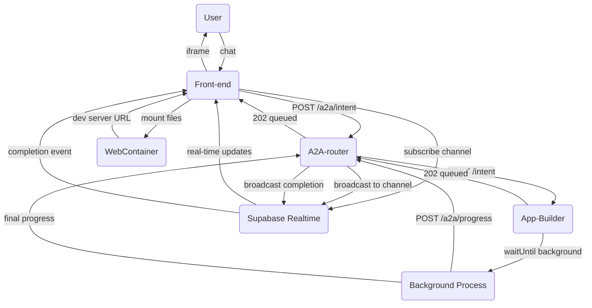

## PRIA Front-End Integration Spec: `app.compose` Flow

### 1. Purpose
This document tells a browser-based client (e.g. a Next.js chat UI + WebContainer runner) exactly **how to talk to the PRIA platform** to generate and preview a custom application.  It covers:

* the conversational product-discovery loop
* the final handoff of generated application files and package dependencies

### 2. Actors & Endpoints
| Actor | Base URL | Responsibilities |
|-------|----------|------------------|
| **Front-end** | (your web origin) | Sends user input, receives responses & files, subscribes directly to Supabase Realtime |
| **A2A-router** | `http://localhost:9999` (default) | Routes requests to the correct agent, handles progress broadcasts **(requires `x-api-key` header when `A2A_API_KEY` env var is set)** |
| **App-Builder agent** | registered at runtime (e.g. `http://localhost:4001`) | Runs phases 0-4 and returns files/deps |
| **Supabase Realtime** | (your Supabase project URL) | Provides real-time progress updates via WebSocket channels |

> **Authentication**
> 
> If the router is started with `A2A_API_KEY=your-secret`, every HTTP request **must** include header:
> 
> ```
> x-api-key: your-secret
> ```
> 
> For local development you can omit `A2A_API_KEY` to disable auth.

### 3. Request / Response Shapes
#### 3.1 POST `/a2a/intent` (router)
```
// first turn
{
  "intent": "app.compose",
  "userInput": "I want a budgeting tool…",
  "history": [],          // empty on first turn
  "trace_id": "<optional>"
}

// subsequent turns
{
  "intent": "app.compose",
  "conversationId": "conv-abc123…",
  "userInput": "Yes, proceed",
  "history": [               // all prior turns in order
    { "role": "user",      "content": "I want a budgeting tool…" },
    { "role": "assistant", "content": "Great! An expense…" }
  ],
  "appSpec": { … },         // latest updatedAppSpec from previous reply
  "confirm": true           // set when user explicitly approves
}
```
Size limit: **25 MB**; clients should gzip (> fetch automatically handles).

#### 3.2 Router → Front-end response
```
// during discovery (LLM needs more info)
{
  "status": "AWAITING_USER_INPUT",
  "responseToUser": "Great – what categories do you need?",
  "conversationId": "conv-abc123…",
  "updatedAppSpec": { … },    // current spec draft
  "needsConfirmation": true   // show "Confirm" button in UI
}

// background job accepted (heavy phases running)
{
  "ok": true,
  "status": "queued",
  "conversationId": "conv-abc123…"
}
```

Field definitions:
* `status` – `AWAITING_USER_INPUT` | `queued` | `in_progress` (Realtime only) | `completed` | `error`.
* `conversationId` – opaque string; include on every subsequent turn.
* `responseToUser` – text to show in chat UI.
* `needsConfirmation` – boolean present only when the spec is fully drafted and the user must explicitly approve proceeding to the build phase.

#### 3.3 Progress Updates (Supabase Realtime)
Long-running phases (plan → scaffold) emit real-time progress updates via **Supabase Realtime channels**.

The front-end **subscribes directly to Supabase Realtime** using the `conversationId` as soon as it's available. This approach is much more reliable than SSE in serverless environments.

##### Technical Implementation Details
Each conversation gets its own Supabase Realtime channel named `progress:{conversationId}`. The App-Builder agent broadcasts progress updates directly to these channels, and the frontend subscribes to receive real-time updates.

**Benefits of Direct Supabase Realtime:**
- ✅ **No serverless function limitations** - direct WebSocket connection
- ✅ **Reliable real-time updates** - no intermediate layers
- ✅ **Better error handling** - Supabase handles reconnection automatically
- ✅ **Simpler architecture** - fewer moving parts

**Progress Update Reliability**: The App-Builder agent uses a `Promise.race` timeout pattern (5-second timeout) when sending progress updates to prevent hanging in serverless environments.

##### Event payload
Each progress update broadcast has this shape:

```json
{
  "conversationId": "conv-abc123…",
  "status": "in_progress",      // queued | in_progress | completed | error
  "phase": "codegen",           // discovery | plan | codegen | review | testgen | scaffold | completed | error
  "percent": 60,                 // integer 0-100 (rough estimate)
  "message": "Code generation complete"
}
```

##### Final completion event
When `status` becomes `completed`, the `message` field contains the full results:

```json
{
  "conversationId": "conv-abc123…",
  "status": "completed",
  "phase": "completed",
  "percent": 100,
  "message": {
    "message": "Application composition complete. A draft PR has been opened.",
    "files": [
      { "path": "app/page.tsx", "content": "'use client'\nexport default function …" },
      { "path": "components/Chart.tsx", "content": "…" }
    ],
    "dependencies": ["zod@^3.22.4", "lucide-react@latest"],
    "github_pr_url": "https://github.com/org/repo/pull/42"
  }
}
```

#### Frontend Implementation
```typescript
import { createClient } from '@supabase/supabase-js'

const supabase = createClient(SUPABASE_URL, SUPABASE_ANON_KEY)

function subscribeToProgress(conversationId: string) {
  const channelName = `progress:${conversationId}`;
  
  const channel = supabase.channel(channelName, {
    config: {
      broadcast: { self: true }
    }
  })
    .on('broadcast', { event: 'update' }, ({ payload }) => {
      console.log('Progress update:', payload);
      updateProgressUI(payload);
      
      // Handle final completion
      if (payload.status === 'completed' && payload.message?.files) {
        handleCompletedFiles(payload.message.files, payload.message.dependencies);
        channel.unsubscribe();
      }
      
      // Handle errors
      if (payload.status === 'error') {
        handleError(payload.message);
        channel.unsubscribe();
      }
    })
    .subscribe((status) => {
      if (status === 'SUBSCRIBED') {
        console.log(`Subscribed to progress updates for ${conversationId}`);
      } else if (status === 'CHANNEL_ERROR') {
        console.error('Failed to subscribe to progress updates');
      }
    });
    
  return channel;
}

// Usage
async function submitIntent(intentData) {
  const response = await fetch('/a2a/intent', {
    method: 'POST',
    headers: { 'Content-Type': 'application/json' },
    body: JSON.stringify(intentData)
  });
  
  const result = await response.json();
  
  if (result.conversationId) {
    // Subscribe to real-time updates immediately
    subscribeToProgress(result.conversationId);
  }
  
  return result;
}
```

#### 3.4 Background Task Execution
The App-Builder agent uses **Vercel's native background task pattern** with `@vercel/functions` and `waitUntil()` for reliable serverless execution:

```typescript
import { waitUntil } from '@vercel/functions';

// Immediately respond 202 to client
res.status(202).json({ ok: true, status: 'queued', conversationId });

// Use waitUntil for proper background processing
waitUntil((async () => {
  try {
    await handleAppComposeIntent({...});
  } catch (err) {
    await sendProgress(conversationId, 'error', 100, err?.message, 'error');
  }
})());
```

This pattern ensures background tasks complete even after the HTTP response is sent, with a configured `maxDuration: 800` seconds in `vercel.json`.

#### 3.5 Payload size & compression
No change: still ≤ **25 MB** JSON; router uses gzip automatically.

### 4. Sequence Diagram


### 5. Front-End Responsibilities
1. **Boot WebContainer once** (`WebContainer.boot()`), reuse for the entire session.
2. **Initialize Supabase client** with your project credentials.
3. On every chat submission:
   1. `POST /a2a/intent` (see 3.1).
   2. If `status === 'AWAITING_USER_INPUT'` ⇒ display `responseToUser`.
       * If `needsConfirmation` is true, enable a **Confirm** button; clicking it should resend the same chat turn with `{ confirm: true }`.
   3. As soon as you have a `conversationId`, **subscribe to Supabase Realtime** channel `progress:{conversationId}`.
   4. Progress events arrive over Realtime (`status: 'in_progress'` with `phase`, `percent`, `message`).
   5. When a final Realtime update comes with `status: 'completed'`:
      * Extract `files` and `dependencies` from the event payload
      * Mount the generated application files in WebContainer
      * Install dependencies and start the development server

### 6. WebContainer Integration
When the final `completed` event arrives with files, mount them in WebContainer:

```typescript
async function handleCompletedFiles(files: Array<{path: string, content: string}>, dependencies: string[]) {
  // 1. Create directory structure and write files
  for (const file of files) {
    // Ensure parent directories exist
    const parentDir = path.dirname(file.path);
    if (parentDir !== '.') {
      await webcontainer.fs.mkdir(parentDir, { recursive: true });
    }
    
    // Write file content
    await webcontainer.fs.writeFile(file.path, file.content);
  }
  
  // 2. Install dependencies
  if (dependencies && dependencies.length > 0) {
    const installProcess = await webcontainer.spawn('npm', ['install', ...dependencies]);
    await installProcess.exit;
  }
  
  // 3. Start development server
  const serverProcess = await webcontainer.spawn('npm', ['run', 'dev']);
  
  // 4. Listen for server URL
  serverProcess.output.pipeTo(new WritableStream({
    write(data) {
      const output = new TextDecoder().decode(data);
      const urlMatch = output.match(/Local:\s+(https?:\/\/[^\s]+)/);
      if (urlMatch) {
        const devServerUrl = urlMatch[1];
        // Display in iframe
        showPreview(devServerUrl);
      }
    }
  }));
}
```

### 7. Error Handling & Troubleshooting

#### Common Issues:
1. **Supabase Connection Issues**: Ensure correct SUPABASE_URL and SUPABASE_ANON_KEY are configured
2. **Channel Subscription Failures**: Check browser network tab for WebSocket connection status
3. **Progress Update Timeouts**: App-Builder has 5-second timeouts on progress updates. Missing updates are non-critical.
4. **Background Task Limits**: Vercel functions have 800-second maximum duration. Very large applications may hit this limit.
5. **WebContainer Mounting**: Ensure parent directories are created before writing files.

#### Debugging:
- Check browser console for Supabase Realtime connection status
- Monitor A2A Router logs for progress broadcast attempts
- Verify `x-api-key` header if authentication is enabled
- Check App-Builder logs for background task execution status
- Use Supabase Dashboard to monitor Realtime channel activity

#### Required Environment Variables:
**Frontend:**
```
SUPABASE_URL=your_supabase_project_url
SUPABASE_ANON_KEY=your_supabase_anon_key
```

**Backend (A2A Router & App-Builder):**
```
SUPABASE_URL=your_supabase_project_url
SUPABASE_SERVICE_ROLE_KEY=your_supabase_service_role_key
A2A_ROUTER_URL=your_a2a_router_url
```

