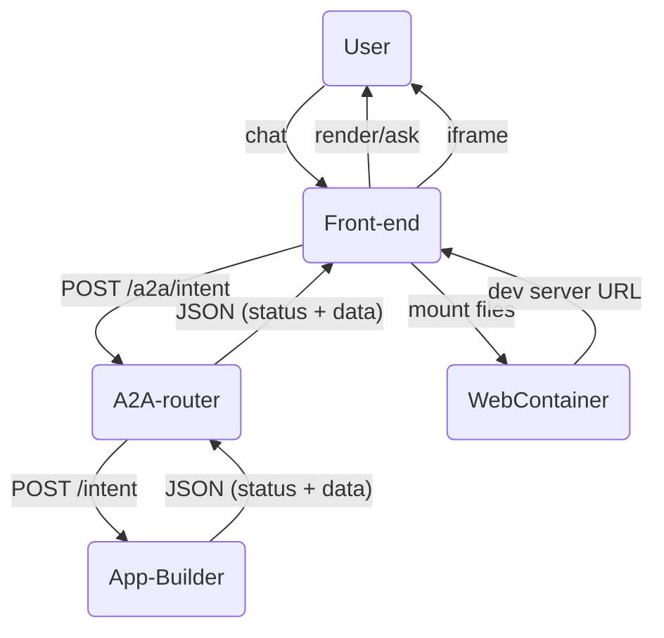

## PRIA Front-End Integration Spec: `app.compose` Flow

### 1. Purpose
This document tells a browser-based client (e.g. a Next.js chat UI + WebContainer runner) exactly **how to talk to the PRIA platform** to generate and preview a custom application.  It covers:

* the conversational product-discovery loop
* the final handoff of generated application files and package dependencies

### 2. Actors & Endpoints
| Actor | Base URL | Responsibilities |
|-------|----------|------------------|
| **Front-end** | (your web origin) | Sends user input, receives responses & files, mounts them in WebContainer |
| **A2A-router** | `http://localhost:9999` (default) | Routes requests to the correct agent, manages lightweight conversation cache **(requires `x-api-key` header when `A2A_API_KEY` env var is set)** |
| **App-Builder agent** | registered at runtime (e.g. `http://localhost:4001`) | Runs phases 0-4 and returns files/deps |

> **Authentication**
> 
> If the router is started with `A2A_API_KEY=your-secret`, every HTTP request **must** include header:
> 
> ```
> x-api-key: your-secret
> ```
> 
> For local development you can omit `A2A_API_KEY` to disable auth.

### 3. Request / Response Shapes
#### 3.1 POST `/a2a/intent` (router)
```
// first turn
{
  "intent": "app.compose",
  "userInput": "I want a budgeting tool…",
  "history": [],          // empty on first turn
  "trace_id": "<optional>"
}

// subsequent turns
{
  "intent": "app.compose",
  "conversationId": "conv-abc123…",
  "userInput": "Yes, proceed",
  "history": [               // all prior turns in order
    { "role": "user",      "content": "I want a budgeting tool…" },
    { "role": "assistant", "content": "Great! An expense…" }
  ],
  "appSpec": { … },         // latest updatedAppSpec from previous reply
  "confirm": true           // set when user explicitly approves
}
```
Size limit: **25 MB**; clients should gzip (> fetch automatically handles).

#### 3.2 Router → Front-end response
```
// during discovery
{
  "status": "AWAITING_USER_INPUT",
  "responseToUser": "Great – what categories do you need?",
  "conversationId": "conv-abc123…"
}

// after build completes
{
  "status": "completed",
  "message": "Application composition complete. A draft PR has been opened.",
  "conversationId": "conv-abc123…",
  "files": [                  // NEW in upcoming agent build
    { "path": "app/page.tsx", "content": "'use client'\nexport default function …" },
    { "path": "components/Chart.tsx", "content": "…" },
    …
  ],
  "dependencies": [           // semver optional; omit to use latest
    "zod@^3.22.4",
    "lucide-react@latest"
  ],
  "github_pr_url": "https://github.com/org/repo/pull/42" // when skip_github=false
}
```

Field definitions:
* `status` – `AWAITING_USER_INPUT` | `completed` | `error`.
* `conversationId` – opaque string; include on every subsequent turn.
* `responseToUser` – text to show in chat UI.
* `files` – array of `{ path, content }`; present only on `completed`.
* `dependencies` – npm package strings.
* `github_pr_url` – optional convenience link.

#### 3.3 Progress Stream (Server-Sent Events)
A long-running build can emit real-time progress updates via SSE.

#### Subscribe (front-end → router)
```
GET /a2a/stream/:conversationId
Accept: text/event-stream
```
The router keeps the HTTP connection open and streams `data:` events until `status` becomes `completed` or `error`.

#### Push update (agent → router)
```
POST /a2a/progress
{
  "conversationId": "conv-abc123…",
  "status": "in_progress",      // in_progress | completed | error
  "phase": "codegen",           // discovery | plan | codegen | review | testgen | scaffold | completed | error
  "percent": 60,                 // 0-100 (rough estimate)
  "message": "Code generation complete"
}
```
The router fan-outs the JSON (as text) to every SSE subscriber:
```
data: {"conversationId":"conv-abc123…","status":"in_progress",…}


```
When `status` equals `completed` or `error` the router closes the stream.

#### Front-end handling
```ts
const src = new EventSource(`/a2a/stream/${conversationId}`);
src.onmessage = (e) => {
  const update = JSON.parse(e.data);
  // update progress bar / log
  if (update.status !== 'in_progress') src.close();
};
```

#### 3.4 Payload size & compression
No change: still ≤ **25 MB** JSON; router uses gzip automatically.

### 4. Sequence Diagram


### 5. Front-End Responsibilities
1. **Boot WebContainer once** (`WebContainer.boot()`), reuse for the entire session.
2. On every chat submission:
   1. `POST /a2a/intent` (see 3.1).
   2. Show `responseToUser` text in chat.
   3. If `status === 'completed'`:
      * For each element in `files`:
        * `fs.mkdir` parent directories (recursive).
        * `