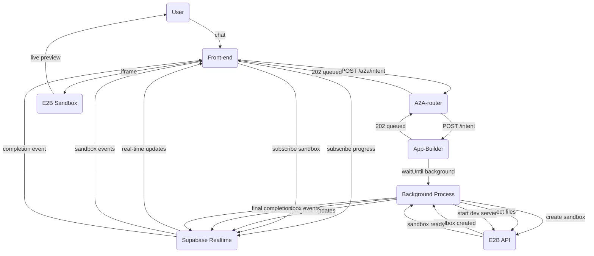

## PRIA Front-End Integration Spec: `app.compose` Flow with E2B Sandbox

### 1. Purpose
This document tells a browser-based client (e.g. a Next.js chat UI) exactly **how to talk to the PRIA platform** to generate and preview a custom application using **E2B cloud sandboxes**. It covers:

* the conversational product-discovery loop
* the final handoff of generated application files and package dependencies
* real-time sandbox creation and live preview display

### 2. Actors & Endpoints
| Actor | Base URL | Responsibilities |
|-------|----------|------------------|
| **Front-end** | (your web origin) | Sends user input, receives responses, subscribes directly to Supabase Realtime |
| **A2A-router** | `http://localhost:9999` (default) | Routes requests to the correct agent, handles progress broadcasts **(requires `x-api-key` header when `A2A_API_KEY` env var is set)** |
| **App-Builder agent** | registered at runtime (e.g. `http://localhost:4001`) | Runs phases 0-4, creates E2B sandbox, returns files/deps |
| **Supabase Realtime** | (your Supabase project URL) | Provides real-time progress updates and sandbox events via WebSocket channels |
| **E2B Sandbox** | `https://3000-{sandbox-id}.e2b.app` | Cloud-based Next.js development environment with live preview |

> **Authentication**
> 
> If the router is started with `A2A_API_KEY=your-secret`, every HTTP request **must** include header:
> 
> ```
> x-api-key: your-secret
> ```
> 
> For local development you can omit `A2A_API_KEY` to disable auth.

### 3. Request / Response Shapes
#### 3.1 POST `/a2a/intent` (router)
```
// first turn
{
  "intent": "app.compose",
  "userInput": "I want a budgeting tool…",
  "history": [],          // empty on first turn
  "trace_id": "<optional>"
}

// subsequent turns
{
  "intent": "app.compose",
  "conversationId": "conv-abc123…",
  "userInput": "Yes, proceed",
  "history": [               // all prior turns in order
    { "role": "user",      "content": "I want a budgeting tool…" },
    { "role": "assistant", "content": "Great! An expense…" }
  ],
  "appSpec": { … },         // latest updatedAppSpec from previous reply
  "confirm": true           // set when user explicitly approves
}
```
Size limit: **25 MB**; clients should gzip (> fetch automatically handles).

#### 3.2 Router → Front-end response
```
// during discovery (LLM needs more info)
{
  "status": "AWAITING_USER_INPUT",
  "responseToUser": "Great – what categories do you need?",
  "conversationId": "conv-abc123…",
  "updatedAppSpec": { … },    // current spec draft
  "needsConfirmation": true   // show "Confirm" button in UI
}

// background job accepted (heavy phases running)
{
  "ok": true,
  "status": "queued",
  "conversationId": "conv-abc123…"
}
```

Field definitions:
* `status` – `AWAITING_USER_INPUT` | `queued` | `in_progress` (Realtime only) | `completed` | `error`.
* `conversationId` – opaque string; include on every subsequent turn.
* `responseToUser` – text to show in chat UI.
* `needsConfirmation` – boolean present only when the spec is fully drafted and the user must explicitly approve proceeding to the build phase.

#### 3.3 Progress Updates (Supabase Realtime)
Long-running phases (plan → scaffold → sandbox creation) emit real-time progress updates via **Supabase Realtime channels**.

The front-end **subscribes directly to Supabase Realtime** using the `conversationId` as soon as it's available. This approach is much more reliable than SSE in serverless environments.

##### Technical Implementation Details
Each conversation gets its own Supabase Realtime channel named `progress:{conversationId}`. The App-Builder agent broadcasts progress updates directly to these channels, and the frontend subscribes to receive real-time updates.

**Benefits of Direct Supabase Realtime:**
- ✅ **No serverless function limitations** - direct WebSocket connection
- ✅ **Reliable real-time updates** - no intermediate layers
- ✅ **Better error handling** - Supabase handles reconnection automatically
- ✅ **Simpler architecture** - fewer moving parts

**Progress Update Reliability**: The App-Builder agent uses a `Promise.race` timeout pattern (5-second timeout) when sending progress updates to prevent hanging in serverless environments.

##### Event payload
Each progress update broadcast has this shape:

```json
{
  "conversationId": "conv-abc123…",
  "status": "in_progress",      // queued | in_progress | completed | error
  "phase": "codegen",           // discovery | plan | codegen | review | testgen | scaffold | sandbox | completed | error
  "percent": 60,                 // integer 0-100 (see detailed mapping below)
  "message": "Code generation complete"
}
```

##### **🔄 UPDATED:** Detailed Progress Phase Mapping
The actual progress percentages and phases used by the App-Builder agent:

| Phase | Progress % | Status Messages |
|-------|------------|----------------|
| **discovery** | 50% | "Awaiting user input for clarification" |
| **plan** | 0% → 20% | "Planning application" → "Plan complete" |
| **codegen** | 25% → 60% | "Generating application code" → "Code generation complete" |
| **review** | 65% → 75% | "Reviewing generated code" → "Review complete" |
| **testgen** | 80% → 90% | "Generating tests" → "Tests generated" |
| **scaffold** | 95% | "Writing scaffold to disk" (only in non-Vercel environments) |
| **sandbox** | 62% → 95% → 100% | "Starting live preview sandbox..." → "Finalizing live preview sandbox..." → "Live preview ready: {url}" |
| **completed** | 100% | Final completion with files and metadata |
| **error** | 100% | Error state with failure message |

##### Final completion event
When `status` becomes `completed`, the `message` field contains the full results:

```json
{
  "conversationId": "conv-abc123…",
  "status": "completed",
  "phase": "completed",
  "percent": 100,
  "message": {
    "message": "Application composition complete with live preview.",
    "files": [
      { "path": "app/page.tsx", "content": "'use client'\nexport default function …" },
      { "path": "components/Chart.tsx", "content": "…" }
    ],
    "dependencies": ["zod@^3.22.4", "lucide-react@latest"],
    "sandboxUrl": "https://3000-abc123def456ghi789.e2b.app",
    "sandboxId": "abc123def456ghi789",
    "github_pr_url": "https://github.com/org/repo/pull/42"
  }
}
```

#### 3.4 Sandbox Events (Supabase Realtime)
In addition to progress updates, the frontend also subscribes to sandbox-specific events on channel `conversation:{conversationId}`:

##### Sandbox Event Types
```typescript
interface SandboxEvent {
  event_type: 'sandbox_created' | 'sandbox_ready' | 'sandbox_failed'
  conversation_id: string
  workspace_id: string
  sandbox_id?: string
  sandbox_url?: string
  message: string
  timestamp: string
  metadata?: any
}
```

##### Sandbox Event Flow
1. **sandbox_created**: E2B sandbox creation started
   ```json
   {
     "event_type": "sandbox_created",
     "conversation_id": "conv-abc123",
     "workspace_id": "ws-xyz789",
     "message": "Creating live preview sandbox...",
     "timestamp": "2024-01-15T10:30:00Z"
   }
   ```

2. **sandbox_ready**: Sandbox is ready with live URL
   ```json
   {
     "event_type": "sandbox_ready",
     "conversation_id": "conv-abc123",
     "workspace_id": "ws-xyz789",
     "sandbox_id": "abc123-def456",
     "sandbox_url": "https://3000-abc123def456.e2b.app",
     "message": "Live preview ready: https://3000-abc123def456.e2b.app",
     "timestamp": "2024-01-15T10:32:00Z"
   }
   ```

3. **sandbox_failed**: Sandbox creation failed
   ```json
   {
     "event_type": "sandbox_failed",
     "conversation_id": "conv-abc123",
     "workspace_id": "ws-xyz789",
     "message": "Live preview creation failed: Template build error",
     "timestamp": "2024-01-15T10:31:30Z",
     "metadata": { "error": "npm install failed" }
   }
   ```

#### Frontend Implementation
```typescript
import { createClient } from '@supabase/supabase-js'

const supabase = createClient(SUPABASE_URL, SUPABASE_ANON_KEY)

interface SandboxState {
  status: 'idle' | 'creating' | 'ready' | 'failed'
  sandboxUrl?: string
  message?: string
  error?: string
}

function subscribeToProgress(conversationId: string, workspaceId: string) {
  const progressChannelName = `progress:${conversationId}`;
  const sandboxChannelName = `conversation:${conversationId}`;
  
  // Subscribe to progress updates
  const progressChannel = supabase.channel(progressChannelName, {
    config: {
      broadcast: { self: true }
    }
  })
    .on('broadcast', { event: 'update' }, ({ payload }) => {
      console.log('Progress update:', payload);
      updateProgressUI(payload);
      
      // Handle final completion
      if (payload.status === 'completed' && payload.message?.sandboxUrl) {
        handleCompletedApp(payload.message);
        progressChannel.unsubscribe();
      }
      
      // Handle errors
      if (payload.status === 'error') {
        handleError(payload.message);
        progressChannel.unsubscribe();
      }
    })
    .subscribe();

  // Subscribe to sandbox events
  const sandboxChannel = supabase.channel(sandboxChannelName, {
    config: {
      broadcast: { self: false }
    }
  })
    .on('broadcast', { event: 'sandbox_event' }, ({ payload }) => {
      console.log('Sandbox event:', payload);
      handleSandboxEvent(payload);
    })
    .subscribe();
    
  return { progressChannel, sandboxChannel };
}

function handleSandboxEvent(event: SandboxEvent) {
  switch (event.event_type) {
    case 'sandbox_created':
      setSandboxState({
        status: 'creating',
        message: event.message
      });
      break;
      
    case 'sandbox_ready':
      setSandboxState({
        status: 'ready',
        sandboxUrl: event.sandbox_url,
        message: event.message
      });
      // Display live preview iframe
      showLivePreview(event.sandbox_url);
      break;
      
    case 'sandbox_failed':
      setSandboxState({
        status: 'failed',
        error: event.message
      });
      break;
  }
}

// Usage
async function submitIntent(intentData) {
  const response = await fetch('/a2a/intent', {
    method: 'POST',
    headers: { 'Content-Type': 'application/json' },
    body: JSON.stringify(intentData)
  });
  
  const result = await response.json();
  
  if (result.conversationId) {
    // Subscribe to real-time updates immediately
    subscribeToProgress(result.conversationId, workspaceId);
  }
  
  return result;
}
```

#### 3.5 Background Task Execution
The App-Builder agent uses **Vercel's native background task pattern** with `@vercel/functions` and `waitUntil()` for reliable serverless execution:

```typescript
import { waitUntil } from '@vercel/functions';

// Immediately respond 202 to client
res.status(202).json({ ok: true, status: 'queued', conversationId });

// Use waitUntil for proper background processing
waitUntil((async () => {
  try {
    // Run app composition phases
    await handleAppComposeIntent({...});
    
    // Create E2B sandbox with generated files
    const sandboxInfo = await e2bService.createSandbox(
      generatedFiles,
      dependencies,
      { conversationId, workspaceId, templateId, teamId }
    );
    
    // Send final completion with sandbox URL
    await sendProgress(conversationId, 'completed', 100, {
      message: "Application composition complete with live preview.",
      files: generatedFiles,
      dependencies,
      sandboxUrl: sandboxInfo.sandboxUrl,
      sandboxId: sandboxInfo.sandboxId
    }, 'completed');
    
  } catch (err) {
    await sendProgress(conversationId, 'error', 100, err?.message, 'error');
  }
})());
```

This pattern ensures background tasks complete even after the HTTP response is sent, with a configured `maxDuration: 800` seconds in `vercel.json`.

#### 3.6 Payload size & compression
No change: still ≤ **25 MB** JSON; router uses gzip automatically.

### 4. Sequence Diagram


### 5. Front-End Responsibilities
1. **Initialize Supabase client** with your project credentials.
2. On every chat submission:
   1. `POST /a2a/intent` (see 3.1).
   2. If `status === 'AWAITING_USER_INPUT'` ⇒ display `responseToUser`.
       * If `needsConfirmation` is true, enable a **Confirm** button; clicking it should resend the same chat turn with `{ confirm: true }`.
   3. As soon as you have a `conversationId`, **subscribe to Supabase Realtime** channels:
      - `progress:{conversationId}` for build progress
      - `conversation:{conversationId}` for sandbox events
   4. Progress events arrive over Realtime (`status: 'in_progress'` with `phase`, `percent`, `message`).
   5. Sandbox events arrive over Realtime (`sandbox_created`, `sandbox_ready`, `sandbox_failed`).
   6. When sandbox becomes ready, display the live preview iframe with the provided sandbox URL.

### 6. E2B Sandbox Integration
When sandbox events arrive, handle live preview display:

```typescript
interface LivePreviewProps {
  sandboxUrl?: string
  status: 'idle' | 'creating' | 'ready' | 'failed'
  message?: string
  error?: string
}

function LivePreviewPanel({ sandboxUrl, status, message, error }: LivePreviewProps) {
  const renderContent = () => {
    switch (status) {
      case 'idle':
        return (
          <div className="text-center py-8 text-muted-foreground">
            Generate code to see live preview
          </div>
        );
        
      case 'creating':
        return (
          <div className="flex items-center justify-center py-8 space-x-2">
            <Loader2 className="h-5 w-5 animate-spin" />
            <span>{message || 'Creating live preview sandbox...'}</span>
          </div>
        );
        
      case 'ready':
        return (
          <div className="space-y-4">
            <div className="flex items-center justify-between">
              <span className="text-sm font-medium">Live Preview Ready</span>
              <Button 
                variant="outline" 
                size="sm"
                onClick={() => window.open(sandboxUrl, '_blank')}
              >
                <ExternalLink className="h-4 w-4 mr-1" />
                Open in New Tab
              </Button>
            </div>
            
            {sandboxUrl && (
              <div className="border rounded-lg overflow-hidden">
                <iframe
                  src={sandboxUrl}
                  className="w-full h-96"
                  title="Live Preview"
                  sandbox="allow-scripts allow-same-origin allow-forms"
                />
              </div>
            )}
          </div>
        );
        
      case 'failed':
        return (
          <div className="flex items-center space-x-2 text-destructive py-8">
            <AlertCircle className="h-5 w-5" />
            <span>{error || 'Failed to create live preview'}</span>
          </div>
        );
        
      default:
        return null;
    }
  };

  return (
    <Card>
      <CardHeader>
        <CardTitle>Live Preview</CardTitle>
      </CardHeader>
      <CardContent>
        {renderContent()}
      </CardContent>
    </Card>
  );
}

// React Hook for managing sandbox state
function useSandboxState(conversationId: string, workspaceId: string) {
  const [sandboxState, setSandboxState] = useState<LivePreviewProps>({
    status: 'idle'
  });

  useEffect(() => {
    if (!conversationId) return;

    const channel = supabase.channel(`conversation:${conversationId}`);
    
    channel.on('broadcast', { event: 'sandbox_event' }, ({ payload }) => {
      const event = payload as SandboxEvent;
      
      switch (event.event_type) {
        case 'sandbox_created':
          setSandboxState({
            status: 'creating',
            message: event.message
          });
          break;
          
        case 'sandbox_ready':
          setSandboxState({
            status: 'ready',
            sandboxUrl: event.sandbox_url,
            message: event.message
          });
          break;
          
        case 'sandbox_failed':
          setSandboxState({
            status: 'failed',
            error: event.message
          });
          break;
      }
    }).subscribe();

    return () => {
      channel.unsubscribe();
    };
  }, [conversationId]);

  return sandboxState;
}
```

### 7. Error Handling & Troubleshooting

#### Common Issues:
1. **Supabase Connection Issues**: Ensure correct SUPABASE_URL and SUPABASE_ANON_KEY are configured
2. **Channel Subscription Failures**: Check browser network tab for WebSocket connection status
3. **Progress Update Timeouts**: App-Builder has 5-second timeouts on progress updates. Missing updates are non-critical.
4. **Background Task Limits**: Vercel functions have 800-second maximum duration. Very large applications may hit this limit.
5. **E2B Sandbox Creation**: E2B has a 5-minute timeout for sandbox creation. Template build failures will emit `sandbox_failed` events.
6. **E2B API Limits**: Check E2B API key and team limits if sandboxes fail to create.

#### Debugging:
- Check browser console for Supabase Realtime connection status
- Monitor A2A Router logs for progress broadcast attempts
- Verify `x-api-key` header if authentication is enabled
- Check App-Builder logs for background task execution status
- Use Supabase Dashboard to monitor Realtime channel activity
- Check E2B Dashboard for sandbox creation logs and errors
- Verify E2B template ID (`bslm087lozmkvjz6nwle`) is correct

#### Required Environment Variables:
**Frontend:**
```
NEXT_PUBLIC_SUPABASE_URL=your_supabase_project_url
NEXT_PUBLIC_SUPABASE_ANON_KEY=your_supabase_anon_key
```

**Backend (A2A Router & App-Builder):**
```
SUPABASE_URL=your_supabase_project_url
SUPABASE_SERVICE_ROLE_KEY=your_supabase_service_role_key
A2A_ROUTER_URL=your_a2a_router_url
E2B_API_KEY=your_e2b_api_key
E2B_TEMPLATE_ID=bslm087lozmkvjz6nwle
E2B_TEAM_ID=d9ae965a-2a35-4a01-bc6e-6ff76faaa12c
```

### 8. Security Considerations

#### Iframe Sandboxing
E2B sandboxes run in secure cloud environments, but frontend should still implement proper iframe sandboxing:

```html
<iframe
  src={sandboxUrl}
  sandbox="allow-scripts allow-same-origin allow-forms"
  className="w-full h-96"
  title="Live Preview"
/>
```

#### URL Validation
Validate that sandbox URLs come from trusted E2B domains:

```typescript
function isValidSandboxUrl(url: string): boolean {
  try {
    const parsed = new URL(url);
    return parsed.hostname.endsWith('.e2b.app');
  } catch {
    return false;
  }
}
```

#### CSP Headers
Configure Content Security Policy to allow E2B iframe embedding:

```
Content-Security-Policy: frame-src *.e2b.app; script-src 'self' 'unsafe-inline';
```

### 9. Performance Considerations

#### Connection Management
- Reuse Supabase channels when possible
- Clean up subscriptions on component unmount
- Implement exponential backoff for failed connections

#### Sandbox Lifecycle
- E2B sandboxes have a default 1-hour timeout
- Implement sandbox cleanup after conversation ends
- Consider sandbox pooling for high-traffic scenarios

#### Fallback Strategy
If E2B sandbox creation fails, display error with option to:
1. Retry sandbox creation
2. Download generated files for local development
3. View code in read-only mode

This updated specification replaces WebContainer with E2B cloud sandboxes while maintaining the same reliable real-time communication patterns and user experience.