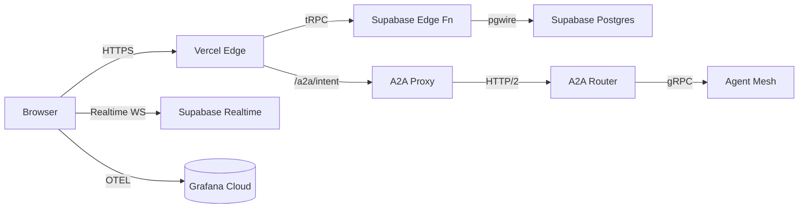

# F1 — PRIA Admin Console Requirements Specification

**Document status:** Final v1.2 · June 2025  
**Author:** Per Swedenborg (CEO)

**Purpose:** Define the functional, non‑functional, and technical requirements for **PRIA's internal Admin Console**—a Next.js 15 application that lets platform operators and tenant admins observe live operations, design new UIs, compose workflows, extend the data‑model, and explore the best‑practices catalogue.  Customer‑facing workspace apps are generated separately and are **out of scope** for this specification.

---

## Table of Contents
1. Scope & Objectives  
2. Technology Stack  
3. Architecture Overview  
4. Core Capabilities  
5. Routing & Navigation  
6. State Management & Data Access  
7. Communication Patterns  
8. Authentication & Sessions  
9. Authorisation & Feature Gating  
10. UI/UX Foundations  
11. Environment Variables  
12. Observability Budgets  
13. Accessibility & I18n  
14. Testing Strategy  
15. Build & Deployment  
16. Security Considerations  
17. Future Enhancements  
18. Revision History

---

## 1  Scope & Objectives
* Serve as a **single pane of glass** for platform operators and tenant admins to:
  * **Observe** live system health, incidents, and agent activity.
  * **Review** and **request** changes to UIs, workflows, and data‑models that are **authored by autonomous A2A agents**.
  * **Approve** best‑practice templates and guide agents to publish them to customer workspaces.
  * **Audit** the lineage and execution history of agent‑generated assets.
* Human users do **not** directly edit source code or DSL in this console; they **submit change requests** that agents fulfil.
* Built on **Next.js 15** (App‑Router) deployed to Vercel Edge.
* All inter‑service communication uses the **A2A Gateway** (HTTP/2 + Protobuf).
* Uses **Supabase** for Postgres, Edge Functions, Realtime, and JWT Auth.
* Performance targets: **p75 LCP ≤ 2.5 s**, **p95 REST latency ≤ 300 ms**.

## 2  Technology Stack
| Layer            | Choice                                      | Rationale                                   |
| ---------------- | ------------------------------------------- | ------------------------------------------- |
| Framework        | Next.js 15 (App Router)                     | Edge‑optimised React Server Components.     |
| UI Runtime       | React 19, Tailwind CSS, shadcn/ui           | Accessible primitives, fast theming.        |
| Data Layer       | tRPC v11, React Query, Zustand              | Type‑safe RPC, client cache, local state.    |
| Supabase Client  | `@supabase/supabase-js` v3                  | DB, Edge Functions, Realtime, Auth.          |
| A2A Client       | `@pria/a2a-client` (Protobuf generated)     | Intent and Exchange API.                    |
| Observability    | OpenTelemetry JS SDK → Grafana Cloud        | Metrics, traces, logs.                      |
| Testing          | Playwright, React Testing Library, axe-core | E2E, component, accessibility.              |

## 3  Architecture Overview

## 4  Core Capabilities
| Capability                       | Human Interaction Model                                                     | Primary Route |
| -------------------------------- | ---------------------------------------------------------------------------- | ------------- |
| **Operations Dashboard**         | View revenue, usage, resource metrics, and notifications.                    | `/dashboard`  |
| **Agent Workflows**              | Inspect agent‑generated workflows; submit change requests; approve versions. | `/workflows`  |
| **Data Models**                  | Browse schema; propose new fields; approve extensions.                       | `/data-models`|
| **User Interfaces**              | Preview agent‑generated pages; request tweaks; publish to tenants.           | `/ui-builder` |
| **Workspace Apps**               | Launch a conversational builder (powered by v0.dev‑style agent) to scaffold complete Next.js workspace apps; approve deployment. **UI must reflect the enforced build loop: all app builds are classified as domain or custom, use the best-practice catalogue, and require compliance validation before preview/PR.** | `/workspace-apps` |
| **Integrations**                 | View installed connectors; request new integrations; manage credentials.     | `/integrations` |
| **Reporting**                    | Access KPI dashboards and export data.                                       | `/reporting`  |
| **Best‑Practice Catalogue**      | Explore templates; instruct agents to customise & deploy.                    | `/catalogue`  |
| **Monitoring & Logs**            | Inspect OTEL metrics, logs, and audit trails.                                | `/monitoring` |
| **Settings & Governance**        | Manage workspace, billing, RBAC, FinOps budgets.                             | `/settings/*` |
| **Help & Support**               | Access documentation and support channels.                                   | `/help`       |

**The UI must clearly show the build loop, best-practice catalogue integration, and compliance validation status for each app build.**

Agents perform creation and modification tasks; the console presents status, diffs, and approval dialogs.

## 5  Routing & Navigation

### 5.1  Sidebar Navigation Tree (Main Navigation)

| Group           | Item (icon)                          | Sub‑items                                    | Route Prefix     | Component Notes                                   |
| --------------- | ------------------------------------ | -------------------------------------------- | ---------------- | ----------------------------------------------- |
| Main Navigation | **Dashboard** (layout-dashboard)     | *Overview*, *Recent Activity*, *Quick Tasks* | `/dashboard/*`   | Overview default; widgets & right‑pane metrics. |
|                 | **Agent Workflows** (workflow)       | —                                            | `/workflows`     | Table of workflows + "Create New" action.       |
|                 | **Data Models** (database)           | —                                            | `/data-models`   | Schema explorer & ER diagram.                  |
|                 | **User Interfaces** (layout-grid)    | —                                            | `/ui-builder`    | Conversational agent‑driven UI designer.        |
|                 | **Workspace Apps** (app-window)      | —                                            | `/workspace-apps`| Conversational builder for full workspace apps. |
|                 | **Integrations** (plug)              | —                                            | `/integrations`  | Installed connectors & marketplace link.       |
|                 | **Reporting** (bar-chart)            | *KPIs*, *Exports*                            | `/reporting/*`   | Tabbed charts & export CSV.                    |
|                 | **Best‑Practice Catalogue** (book)   | —                                            | `/catalogue`     | Template gallery.                              |
|                 | **Monitoring & Logs** (activity)     | —                                            | `/monitoring`    | Metrics & Loki log stream.                     |
|                 | **Settings & Governance** (settings) | *Workspace*, *Billing*, *Roles*              | `/settings/*`    | Nested tabs.                                   |
|                 | **Help & Support** (life‑buoy)       | —                                            | `/help`          | FAQ & contact form.                            |
| Projects        | **Design Engineering**               | —                                            | `/projects/design-eng` | Context filter.                          |
|                 | **Sales & Marketing**                | —                                            | `/projects/sales-marketing` | —                                |
|                 | **Finance**                          | —                                            | `/projects/finance` | —                                       |
|                 | **More…**                            | Dynamic list                                 | `/projects`      | Lazy‑loaded; add project modal.                |

### 5.2  Top‑Level Routes & Pages  Top‑Level Routes & Pages

| Route                       | Page Type | Auth Scope(s)         | Notes                                                   |
| --------------------------- | --------- | --------------------- | ------------------------------------------------------- |
| `/login`                    | Client    | —                     | Supabase magic‑link flow.                                |
| `/dashboard`                | RSC       | `admin`               | Metrics, notifications column.                           |
| `/dashboard/recent`         | RSC       | `admin`               | Recent activity feed.                                    |
| `/dashboard/quick-tasks`    | Client    | `admin`               | Quick‑task dialog.                                       |
| `/workflows`                | RSC       | `workflow:read`       | Workflow table & status.                                 |
| `/workflows/new`            | Client    | `workflow:write`      | Conversational builder chat.                                       |
| `/data-models`              | RSC       | `schema:read`         | Schema explorer.                                         |
| `/ui-builder`               | Client    | `ui:write`            | Conversational UI chat.                                      |
| `/integrations`             | RSC       | `integration:read`    | Connector list & install flow.                           |
| `/integrations/install/:id` | Client    | `integration:write`   | Install wizard.                                          |
| `/reporting`                | RSC       | `report:read`         | KPI dashboard tabs.                                      |
| `/monitoring`               | Client    | `admin`               | OTEL dashboards & log viewer.                            |
| `/settings`                 | RSC       | `admin`               | Workspace, Billing, RBAC tabs.                           |
| `/help`                     | RSC       | public                | Documentation, FAQs, contact form.                       |

Breadcrumbs are generated via `usePathname()`; first crumb icon matches the sidebar icon. Right‑hand context column appears on `/dashboard/*` routes rendering incident feed and KPIs.

## 6  State Management & Data Access

### 5.1  Sidebar Navigation Tree

| Group           | Item (icon)                          | Sub‑items                       | Route Prefix          | Component Notes                                 |
| --------------- | ------------------------------------ | ------------------------------- | --------------------- | ----------------------------------------------- |
| **Monitoring**  | **Dashboard** (layout‑dashboard)     | Overview, Incidents             | `/dashboard/*`        | Overview is default; incidents table tab.       |
|                 | **Agent Health** (activity)          | —                               | `/agents/health`      | Shows status & latency charts.                  |
| **Design**      | **Workflow Builder** (workflow)       | —                               | `/workflows`          | Table + "Create New" button.                    |
|                 | **UI Designer** (layout-grid)        | —                               | `/ui-builder`         | Conversational agent‑driven UI designer.                     |
| **Data**        | **Data Models** (database)           | —                               | `/data-models`        | Entity browser & ER diagram.                    |
|                 | **Best‑Practices** (book)            | —                               | `/catalogue`          | Template gallery; install CTA.                  |
| **Governance**  | **Settings** (settings)              | Workspace, Billing, Roles       | `/settings/*`         | Nested tabs.                                    |
|                 | **FinOps & Logs** (bar-chart)         | Logs, Cost                      | `/monitoring`         | Loki stream & cost panels.                      |
| **Help**        | **Support** (life-buoy)              | FAQ                             | `/help`               | Contact form + docs links.                      |

### 5.2  Top‑Level Routes & Pages

| Route                       | Page Type | Auth Scope(s)         | Notes                                                            |
| --------------------------- | --------- | --------------------- | ---------------------------------------------------------------- |
| `/login`                    | Client    | —                     | Supabase magic‑link flow.                                         |
| `/dashboard`                | RSC       | `admin`               | KPIs, live incidents widget.                                      |
| `/agents/health`            | RSC       | `admin`               | List of agents with p95 latency sparkline.                        |
| `/workflows`                | RSC       | `workflow:read`       | Workflow table.                                                   |
| `/workflows/new`            | Client    | `workflow:write`      | Opens graphical builder.                                          |
| `/ui-builder`               | Client    | `ui:write`            | Conversational UI chat.                                          |
| `/data-models`              | RSC       | `schema:read`         | Schema explorer + column wizard.                                  |
| `/catalogue`                | RSC       | `template:read`       | Card grid of best‑practice templates.                             |
| `/monitoring`               | Client    | `admin`               | OTEL dashboards + Loki log stream + cost charts.                  |
| `/settings`                 | RSC       | `admin`               | Workspace, billing, RBAC tabs.                                    |
| `/help`                     | RSC       | public                | FAQ and support contact.                                          |

Breadcrumbs are generated via `usePathname()`; first crumb icon matches the sidebar icon.  A right‑hand context column appears on `/dashboard/*` routes rendering the latest incident feed and KPI sparklines.

## 6  State Management & Data Access
* React Query caches tRPC queries and Intent polling.
* `useSupabase()` returns an authenticated client for Edge Function calls and Realtime channels.
* `useIntent()` wraps A2A client and streams Intent status via SSE.
* UI feature flags stored in Zustand.

## 7  Communication Patterns
| Purpose                | Transport    | Library                        |
| ---------------------- | ------------ | ------------------------------ |
| CRUD & Admin Actions   | HTTP (Edge)  | `@supabase/supabase-js` → Edge Functions |
| Intent messaging       | HTTP/2       | `@pria/a2a-client`             |
| Trace streaming        | SSE          | Native `EventSource`           |
| Live updates           | WebSocket    | Supabase Realtime              |

## 8  Authentication & Sessions
* Supabase Auth issues JWTs with `workspace_id`, `role`, and `scopes[]`.
* Tokens stored in HttpOnly SameSite=Lax cookies; automatic refresh handled by Supabase client.
* React Server Components hydrate with server‑side Supabase helpers.

## 9  Authorisation & Feature Gating
| Scope                      | Example Function                            |
| -------------------------- | ------------------------------------------- |
| `admin`                    | Access Settings & Billing                   |
| `workflow:write`           | Save changes in Workflow Builder            |
| `schema:write`             | Create new tables/columns                   |
| `ui:write`                 | Publish UI Designer pages                  |
| `a2a:route_intent`         | Execute workflow preview via A2A           |

`useScope()` hook checks JWT scopes for conditional rendering.

## 10  UI/UX Foundations
* Responsive grid; Tailwind breakpoints `sm`, `md`, `lg`, `2xl`.
* Dark‑mode via `prefers-color-scheme` + user toggle.
* Storybook documents all components; visual regression tests run in CI.

## 11  Environment Variables
| Variable                         | Example                           | Scope  | Description                                   |
| -------------------------------- | --------------------------------- | ------ | --------------------------------------------- |
| `NEXT_PUBLIC_SUPABASE_URL`       | `https://db.pria.cloud`           | Public | Supabase project URL.                         |
| `NEXT_PUBLIC_SUPABASE_ANON_KEY`  | `sb_anon_…`                       | Public | Public anon key.                              |
| `SUPABASE_SERVICE_ROLE_KEY`      | `sb_srv_…`                        | Server | Elevated Edge Function calls.                |
| `NEXT_PUBLIC_A2A_URL`            | `https://agents.pria.cloud`       | Public | Base URL for A2A Router.                      |
| `A2A_API_KEY`                    | `a2a_sk_…`                        | Server | JWT for server‑side Intent routing.           |

## 12  Observability Budgets
* p95 Intent round‑trip ≤ 300 ms.
* Realtime latency p95 ≤ 150 ms.
* Front‑end bundle gzipped ≤ 250 KB.

## 13  Accessibility & I18n
* WCAG 2.1 AA via jsx‑a11y + axe‑playwright.
* `i18next` default `en‑US`; prepared `sv‑SE`, `de‑DE`.

## 14  Testing Strategy
| Layer        | Tool                        | Goal                          |
| ------------ | --------------------------- | ----------------------------- |
| Unit         | React Testing Library + Jest| ≥ 80 % branch coverage        |
| Integration  | testcontainers + MSW        | Validate Edge Function mocks  |
| E2E          | Playwright                  | Critical admin workflows      |
| Accessibility| axe‑playwright              | Zero violations               |
| Contract     | buf‑generated fixtures      | A2A & Supabase Edge schemas   |

## 15  Build & Deployment
* Vercel project `pria-admin`; preview deploy per PR.
* Build step generates A2A TypeScript client via buf.
* Production deploy via GitHub Action `release.yml`.

## 16  Security Considerations
* JWT verification middleware on every Edge Route.
* Intent payload limited to 16 KB.
* CSP: `default-src 'self'; connect-src 'self' https://*.pria.cloud`.

## 17  Future Enhancements
1. Offline Intent draft storage.
2. Real‑time collaborative UI & workflow editing.
3. Visual timeline debugger for A2A traces.

## 18  Revision History
| Version | Date       | Author           | Notes                                                            |
| ------- | ---------- | ---------------- | ---------------------------------------------------------------- |
| 1.2     | 2025‑06‑14 | Per Swedenborg   | Scoped spec to Admin Console; clarified capabilities & routes.  |
| 1.1     | 2025‑06‑14 | Per Swedenborg   | Supabase‑only back‑end; removed NextAuth.                       |
| 1.0     | 2025‑06‑14 | Per Swedenborg   | Initial A2A‑native front‑end spec.                              |

## 4  Functional Requirements

| Ref      | Requirement                                                                                                                                   |
| -------- | --------------------------------------------------------------------------------------------------------------------------------------------- |
| **F‑01** | Preview loads inside the iframe within **2 seconds** (p75) for projects ≤ 150 KB snapshot.                                                    |
| **F‑02** | WebContainer `stdout/stderr` stream to a console pane in real time.                                                                           |
| **F‑03** | Edits in PRIA's editor call `webcontainer.fs.writeFile` and trigger HMR < 250 ms.                                                             |
| **F‑04** | Preview iframe origin is `https://preview.pria.app/<workspace>/<app>/<session>` and is valid only while the tab is open (no permanent links). |
| **F‑05** | If `server‑ready` has not fired after **20 s** or emits `error`, the system falls back to Remote Preview automatically.                       |
| **F‑06** | Remote Preview pods auto‑terminate **60 min** after last request.                                                                             |
| **F‑07** | Administrators can toggle WebContainers on/off per workspace (feature flag).                                                                  |

**The preview flow must always enforce workspace isolation, Supabase RLS, and compliance validation. Fallback to Remote Preview is automatic if resource or compatibility limits are exceeded.**

