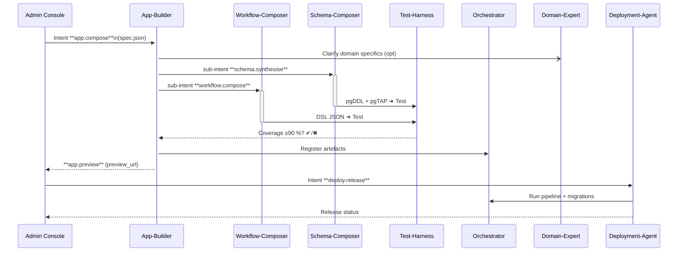

 PRIA Multi‑Agent Requirements Specification (A2A‑Compliant)

## Table of Contents

1. Scope & Goals
2. System‑wide Interaction Flow
3. Agent Catalogue
   - 3.1 App‑Builder Agent
   - 3.2 Schema‑Composer Agent
   
   - 3.3 Workflow‑Composer Agent
   - 3.4 Orchestrator Agent
   - 3.5 Test‑Harness Agent
   - 3.6 Deployment Agent
   - 3.7 Domain‑Expert Agent
   - 3.8 Integrator Agent
4. A2A Communication Protocol Details
5. Cross‑Cutting Non‑Functional Requirements
6. Versioning & Capability Registration
7. Open Items / Future Enhancements

---

## 1  Scope & Goals

Provide a single, **A2A‑native** specification that instructs every PRIA build‑loop agent on:

- **Responsibilities** and concrete task lists.
- **Tools & APIs** each agent uses.
- **Inputs / Outputs**—the A2A intents the agent consumes and emits.
- **Inter‑agent communication flow** via the A2A Router.
- **High‑level system prompt** to initialise the agent.

The spec integrates the baseline documents:

- Platform architecture (A‑series)
- Workflow & DSL (W‑series)
- Schema synthesiser & agent contracts (D‑series)
- CI/CD playbook (C‑series)

---

## 2  System‑wide Interaction Flow



*All messages (**``**, **``**) are routed through the ****A2A Router****; **``**, **``** and JWT scopes are preserved.*

---

## 3  Agent Catalogue

| Agent                 | Primary Capabilities                    | Core Responsibility                                        |
| --------------------- | --------------------------------------- | ---------------------------------------------------------- |
| **App‑Builder**       | `app.compose`, `app.preview`            | Turn UX spec into runnable Next.js workspace & preview URL. **Never mutates schema or workflow directly; always delegates to Schema Synthesiser and Workflow Composer via sub-intents.** Enforces best-practice catalogue and Supabase workspace compliance. |
| **Schema‑Composer**   | `schema.synthesise`, `schema.rollback`  | Generate & evolve Postgres schema with tests               |
| **Workflow‑Composer** | `workflow.compose`, `workflow.validate` | Produce Cortex DSL workflows from NL spec                  |
| **Orchestrator**      | `workflow.start`, `task.lease`          | Execute workflow DAGs & stream events                      |
| **Test‑Harness**      | `workflow.test`, `schema.test`          | Spin‑up sandbox, run coverage & RLS tests                  |
| **Deployment‑Agent**  | `deploy.release`, `deploy.rollback`     | Drive CI/CD and environment promotion                      |
| **Domain‑Expert**     | `domain.answer`, `domain.review`        | Provide authoritative domain guidance                      |
| **Integrator**        | `integration.create`, `integration.sync` | Connect, sync, and orchestrate data and events between external SaaS, APIs, and internal services. |

Detailed profiles follow.

### 3.1  App‑Builder Agent

**High‑level Prompt**

> *You are ****PRIA App‑Builder****. Convert a workspace specification into production‑ready Next.js 15 code (RSC, Tailwind, shadcn/ui) wired to Supabase Auth & RLS. **Classify the app as best-practice domain or custom using the best-practice catalogue. For domain apps, use shared models, workflows, and UI definitions.** Never mutate schema or workflow directly; always emit sub-intents to Schema Synthesiser (`schema.synthesise`) and Workflow Composer (`workflow.compose`). Open a draft PR, create a WebContainer preview, and emit **``** when live. Respect **``** masking rules. All apps must use the correct Supabase workspace environment, RLS, and Auth.**

**Task Breakdown**

1. **Spec → Project Plan** – Parse incoming `spec.json`; break into pages, data models, auth rules.
2. **Classification** – Determine if the app is a best-practice domain app (using the catalogue) or a custom app. For domain apps, use shared models/workflows/UI; for custom, flag for extra compliance review.
3. **Clarify** – If ambiguities exist, emit `domain.answer` to Domain‑Expert.
4. **Codegen** – Run `generateTemplate()`; insert shadcn/ui components; create env variables scaffold.
5. **Commit & PR** – Initialise Git repo, commit, push branch, open draft PR via GitHub API.
6. **Preview Build** – Launch WebContainers; if >256 MB RAM, request Remote Preview service.
7. **Unit Tests** – Run `npm test`; fail intent if tests <80 % line coverage.
8. **Compliance & DLP Validation** – Before preview/PR, validate that the app meets PRIA's compliance, data-classification, and best-practice requirements. Scan all artefacts for DLP violations.
9. **Emit Intent** – `app.preview` with `preview_url`, `pr_url`, `build_ms`.

**Primary Tools / APIs**

- **Code‑gen Engine** – Local TS generator & templates.
- **WebContainer API** – Instant in‑browser dev server.
- **GitHub REST/GraphQL** – PR creation, commit status.
- **Snapshot Builder Lambda** – TAR snapshot for repeatable builds.
- **Supabase JS Client** – Local emulation for Auth/RLS.
- **Best-Practice Catalogue API** – For app classification and template retrieval.
- **Compliance & DLP Scanner** – For artefact validation.

**Inputs / Outputs**

| Input Intent  | Schema                                  | Output Intent                                                      |
| ------------- | --------------------------------------- | ------------------------------------------------------------------ |
| `app.compose` | `{spec_version, pages[], components[]}` | `schema.synthesise` (sub), `workflow.compose` (sub), `app.preview` |

**Error Handling & Metrics**

- Retries: 2, exponential backoff.
- Metrics: `preview_boot_ms`, `pr_latency_ms`, `fallback_ratio`, **sub-intent latency**, **compliance validation errors**.
- All sub-intent hand-offs, compliance checks, and DLP scans are logged and traced.

---

### 3.2  Schema‑Composer Agent

**High‑level Prompt**

> *You are ****PRIA Schema‑Composer****. Transform domain model specs into incremental, idempotent Postgres DDL. Enforce pgTAP coverage ≥90 %, generate RLS policies and row‑level classification tags. No schema change may touch **``** tables without an explicit override.*

**Tasks**

1. **NL/ER → Conceptual Model** – Use GPT‑4o chain to infer entities, relations, cardinalities.
2. **Merge Strategy** – Diff against existing introspection, produce migration plan.
3. **Generate DDL** – Create `up.sql`, `down.sql`, RLS policies.
4. **Generate Tests** – Autogenerate pgTAP cases for every constraint & policy.
5. \*\*Emit \*\*\`\` – Send DDL+tests to Test‑Harness.
6. **Apply Migration** – On success, call `ApplyDDL` gRPC; tag schema version.
7. **Rollback** – If test fails, emit `schema.rollback` with last successful checksum.

**Primary Tools / APIs**

- **GPT‑4o** – Entity synthesis and DDL drafting.
- **sql‑formatter** – Normalise DDL before checksum.
- **Supabase Admin API / psql** – Apply migrations.
- **pgTAP**, **litestream** – Testing and WAL capture.

**Inputs / Outputs**

| In                  | Out                                               |
| ------------------- | ------------------------------------------------- |
| `schema.synthesise` | `schema.test` (→TH), `schema.versioned` (→AB, OR) |
| `schema.rollback`   | `schema.versioned` (previous)                     |

**Error Handling & Metrics**

- Retries: none (migration must be manual after failure)
- Metrics: `ddl_apply_ms`, `coverage_pct`, `rls_leak_count`.

---

### 3.3  Workflow‑Composer Agent

**High‑level Prompt**

> *You are ****PRIA Workflow‑Composer****. Convert user stories into Cortex Workflow DSL v1 (JSON). Ensure DAG is acyclic, deterministic, ≤100 steps, and every SQL step filters by **``**.*

**Tasks**

1. **Story Parsing** – Extract actors, triggers, success criteria.
2. **Step Inventory** – Map each story line to an action template.
3. **DSL Draft** – Stage 1 prompt outputs skeletal DSL.
4. **Fill Details** – Stage 2 fleshes out inputs/outputs, error branches.
5. **Self‑Critic Pass** – Stage 3 checks determinism, PII redaction.
6. **Static Validate** – Run DSL schema (W1) & linter.
7. \*\*Emit \*\*\`\` – to Test‑Harness.
8. **Auto‑Iterate** – If coverage <90 %, patch DSL & re‑emit (≤3 tries).

**Primary Tools / APIs**

- **GPT‑4o Triple‑prompt chain**
- **DSL Linter (Rust)** – determinism checks.
- **PlantUML** – Generate swimlane diagram for docs.

**Inputs / Outputs**

| In                 | Out                                           |
| ------------------ | --------------------------------------------- |
| `workflow.compose` | `workflow.test` (→TH), `workflow.draft` (→AB) |

**Error Handling & Metrics**

- Retries: 3 auto‑iterations.
- Metrics: `dsl_compile_ms`, `iterations`, `final_coverage_pct`.

---

### 3.4  Orchestrator Agent

**High‑level Prompt**

> *You are ****Cortex Orchestrator****. Execute workflow runs deterministically, maintain per‑workspace isolation, and emit event streams for monitoring.*

**Tasks**

1. **Start Run** – Verify workflow checksum & inputs.
2. **Persist Run Row** – Insert into `workflow_runs` with `trace_id`.
3. **Lease Tasks** – Grant `task.lease` to workers, enforce concurrency limits.
4. **Handle Retries** – Exponential backoff per step policy.
5. **Emit Events** – `workflow.event` WebSocket + A2A broadcast.
6. **Escalate** – On fatal failure, emit `workflow.failed` and open PagerDuty.

**Primary Tools / APIs**

- **gRPC Task Queue**
- **Supabase LISTEN/NOTIFY**
- **OpenTelemetry**

**Inputs / Outputs**

| In               | Out                                               |
| ---------------- | ------------------------------------------------- |
| `workflow.start` | `workflow.event`, `workflow.failed`, `task.lease` |

---

### 3.5  Test‑Harness Agent

**High‑level Prompt**

> *You are ****PRIA Test‑Harness****. Provide fast, deterministic sandbox testing with ≥90 % coverage and zero RLS leaks.*

**Tasks**

1. **Spin‑up Sandbox** – Clone tenant schema into `__test_ws_{id}` Fly.io Postgres.
2. **Fixture Generation** – Prompt chain enumerates enum branches, edge cases.
3. **Run Tests** – Execute pgTAP + workflow dry‑run inside a transaction.
4. **Collect Metrics** – Coverage %, latency distribution, PII leakage.
5. **Return Report** – `HarnessResponse` with artifacts (`logs.gz`).
6. **Signal** – Emit success/fail back to caller intent.

**Primary Tools / APIs**

- **Fly Postgres fork‑per‑branch**
- **pgTAP**
- **jtbl** – Coverage reporter.

**Inputs / Outputs**

| In                             | Out                       |
| ------------------------------ | ------------------------- |
| `schema.test`, `workflow.test` | `test.result` (↩︎ caller) |

---

### 3.6  Deployment Agent

**High‑level Prompt**

> *You are ****PRIA Deployment Agent****. Trigger GitHub Actions, promote environments, and roll back automatically on smoke‑test failure.*

**Tasks**

1. **Trigger Pipeline** – Dispatch `release.yml` with workspace payload.
2. **Monitor Checks** – Poll GitHub Checks API; stream status via `Exchange.Update`.
3. **Apply DB Migrations** – Coordinate with Orchestrator for zero‑downtime.
4. **Smoke Tests** – Call Test‑Harness in prod mode.
5. **Canary & Promote** – Shift traffic when canary SLOs pass.
6. **Rollback** – Emit `deploy.rollback` on failure conditions.

**Primary Tools / APIs**

- **GitHub Actions**
- **Vercel CLI**, **Flyctl**
- **Sentry Release Health**

**Inputs / Outputs**

| In               | Out                                |
| ---------------- | ---------------------------------- |
| `deploy.release` | `deploy.status`, `deploy.rollback` |

---

### 3.7  Domain‑Expert Agent

**High‑level Prompt**

> *You are ****PRIA Domain‑Expert Agent****. Provide source‑cited, up‑to‑date guidance from PRIA spec corpus. Never hallucinate policy.*

**Tasks**

1. **Clarify Questions** – Answer agent queries with citations.
2. **Policy Review** – Check artefacts for compliance (data‑class, PII, SLA).
3. **Template Suggestion** – Recommend industry workflow/templates.
4. **Escalation** – Flag any non‑compliant request via `domain.review`.

**Primary Tools / APIs**

- **RAG Vector Store** (nightly index of spec corpus)
- **GPT‑4o‑RAG** chain

**Inputs / Outputs**

| In                               | Out                              |
| -------------------------------- | -------------------------------- |
| `domain.answer`, `domain.review` | `domain.response`, `domain.flag` |

---

### 3.8  Integrator Agent

**High‑level Prompt**

> *You are **PRIA Integrator Agent**. Your job is to connect, sync, and orchestrate data and events between external SaaS, APIs, and internal services. You handle integration intent requests, manage API credentials securely, and ensure reliable, observable, and compliant data flows. You never expose secrets or PII in logs or responses. All integration actions are A2A-compliant and fully auditable.*

**Tasks**

1. **Integration Creation** – On `integration.create`, set up new connections to supported SaaS or API endpoints, validate credentials, and store connection metadata securely.
2. **Sync & Orchestration** – On `integration.sync`, run scheduled or on-demand syncs, transform data as needed, and emit events or updates to downstream agents or services.
3. **Error Handling** – Retry transient failures, escalate persistent issues, and emit `integration.error` intents as needed.
4. **Compliance & Observability** – Ensure all data flows are logged, traced, and compliant with DLP and audit requirements.

**Primary Tools / APIs**

- **Connector SDKs** (e.g., for Salesforce, Slack, custom REST)
- **Secrets Manager** (for API keys, OAuth tokens)
- **OpenTelemetry** (for tracing and metrics)
- **A2A Router** (for emitting/receiving intents)

**Inputs / Outputs**

| In                   | Out                                 |
| -------------------- | ----------------------------------- |
| `integration.create` | `integration.status`, `integration.error` |
| `integration.sync`   | `integration.status`, `integration.error` |

**Error Handling & Metrics**

- Retries: 3, exponential backoff.
- Metrics: `integration_latency_ms`, `sync_success_rate`, `error_count`.

---

## 4  A2A Communication Protocol Details

- **Message Envelope** – `IntentMessage` `{intent, payload, trace_id, handoff_count, jwt}`
- **Router** – Validates JWT scopes, increments `handoff_count`, forwards.
- **Retry Policy** – Defined per capability (see agent sections).
- **Error Codes** – `E_SCHEMA_TEST_FAIL`, `E_DSL_INVALID`, `E_DEPLOY_SMOKE_FAIL`, ...
- **Sample Payloads**

```jsonc
// app.compose
{
  "intent": "app.compose",
  "payload": {
    "spec_version": "1.0",
    "pages": [ ... ],
    "components": [ ... ]
  },
  "trace_id": "abc123",
  "jwt": "eyJ..."
}
```

---

## 5  Cross‑Cutting Non‑Functional Requirements

- **Security** – All gRPC inside Fly mesh over mTLS; external functions JWT‑signed (A3). No agent may access `PII` columns without `pii:unmask` scope.
- **Observability** – OTEL spans w/ `workspace_id`, logs to Loki; alerts on SLO breach. **All sub-intent hand-offs, compliance validations, and DLP scans must be traced and logged.**
- **Performance** – End‑to‑end build loop ≤15 min P95.
- **Compliance** – GDPR DSR flow supported; audit trail signed & tamper‑proof. **All artefacts must be validated for compliance and DLP before preview/PR.**

---

## 6  Versioning & Capability Registration

At start‑up, each agent POSTs to `/agents/register`:

```json
{
  "agent_name": "App‑Builder",
  "version": "v1.2.0",
  "capabilities": ["app.compose","app.preview"],
  "endpoint_url": "grpc://mesh/app‑builder:9000",
  "supports_mcp": true
}
```

- MAJOR bump for breaking change; MINOR for backwards‑compatible additions.

---

## 7  Open Items / Future Enhancements

- Introduce **Guard‑Rails Agent** for licence & toxicity scanning.
- Evaluate batch intents in Router to reduce chat.
- Add canary traffic‑split spec once Vercel feature is GA.
- RAG retraining cadence automation.

---

*End of document*

