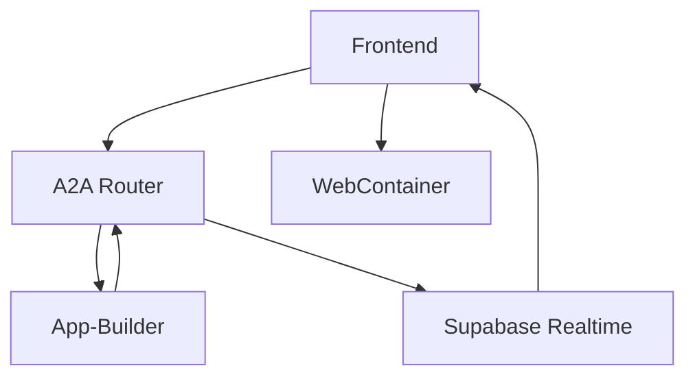

# PRIA SSE to Supabase Realtime Migration Summary

## 🎯 **Problem Solved**

The original SSE (Server-Sent Events) implementation had critical issues in serverless environments:

1. **Serverless Function Limitations**: Vercel functions have 30-second timeouts for the A2A router
2. **Connection Reliability**: SSE requires persistent connections that don't work well with serverless
3. **Race Conditions**: App-Builder might send progress updates before SSE clients were fully subscribed
4. **Complex Architecture**: Multiple layers (App-Builder → A2A Router → SSE → Frontend)

## ✅ **Solution Implemented**

**Direct Supabase Realtime Subscription** - Frontend connects directly to Supabase WebSocket channels.

### **Benefits:**
- ✅ **No serverless limitations** - Direct WebSocket connection
- ✅ **Reliable real-time updates** - No intermediate layers
- ✅ **Better error handling** - Supabase handles reconnection automatically  
- ✅ **Simpler architecture** - Fewer moving parts
- ✅ **Eliminates race conditions** - Channels persist independently of HTTP requests

## 📋 **Changes Made**

### 1. **Updated Integration Specification**
**File**: `specifications/app_compose_frontend_integration.md`

- Replaced SSE documentation with Supabase Realtime approach
- Added frontend implementation examples
- Updated sequence diagram
- Added environment variable requirements
- Enhanced troubleshooting section

### 2. **Simplified A2A Router**
**File**: `a2a-router/src/index.ts`

**Removed:**
- `/a2a/stream/:conversationId` SSE endpoint
- In-memory progress streams fallback
- SSE response handling logic

**Simplified:**
- `/a2a/progress` endpoint now only handles Supabase broadcasting
- Cleaner channel management
- Better error logging

### 3. **Updated App-Builder Comments**
**File**: `app-builder/src/index.ts`

- Updated `sendProgress` function comment to reflect Realtime broadcasting
- No functional changes needed - existing implementation works perfectly

### 4. **Created Frontend Example**
**File**: `specifications/frontend_realtime_example.html`

- Complete working example of direct Supabase Realtime integration
- Shows conversation flow, progress updates, and file handling
- Includes error handling and debugging features

## 🔧 **How It Works Now**

### **New Flow:**


1. **Frontend** submits intent to A2A Router
2. **A2A Router** forwards to App-Builder  
3. **App-Builder** responds 202 and starts background processing
4. **Frontend** subscribes directly to Supabase Realtime channel `progress:{conversationId}`
5. **App-Builder** sends progress updates to A2A Router
6. **A2A Router** broadcasts to Supabase Realtime channel
7. **Frontend** receives real-time updates via WebSocket
8. **Final completion** event contains generated files and dependencies

### **Frontend Implementation:**
```typescript
import { createClient } from '@supabase/supabase-js'

const supabase = createClient(SUPABASE_URL, SUPABASE_ANON_KEY)

function subscribeToProgress(conversationId: string) {
  const channel = supabase.channel(`progress:${conversationId}`, {
    config: {
      broadcast: { self: true }
    }
  })
    .on('broadcast', { event: 'update' }, ({ payload }) => {
      updateProgressUI(payload);
      if (payload.status === 'completed' && payload.message?.files) {
        handleCompletedFiles(payload.message.files, payload.message.dependencies);
      }
    })
    .subscribe();
  return channel;
}
```

## 🚀 **Environment Variables Required**

### **Frontend:**
```env
SUPABASE_URL=your_supabase_project_url
SUPABASE_ANON_KEY=your_supabase_anon_key
```

### **Backend (A2A Router & App-Builder):**
```env
SUPABASE_URL=your_supabase_project_url
SUPABASE_SERVICE_ROLE_KEY=your_supabase_service_role_key
A2A_ROUTER_URL=your_a2a_router_url
```

## 🧪 **Testing the New Implementation**

1. **Open** `specifications/frontend_realtime_example.html` in a browser
2. **Configure** Supabase credentials and A2A Router URL
3. **Initialize** Supabase client
4. **Submit** an intent (e.g., "I want to build an expense tracker")
5. **Watch** real-time progress updates
6. **Confirm** the specification when prompted
7. **Observe** background processing and file generation

## 🔍 **Debugging**

### **Frontend:**
- Check browser console for Supabase connection status
- Monitor WebSocket connections in Network tab
- Verify channel subscription success

### **Backend:**
- Check A2A Router logs for broadcast attempts
- Monitor App-Builder logs for progress send attempts
- Use Supabase Dashboard to view Realtime activity

## 📈 **Performance Improvements**

- **Reduced latency** - No intermediate HTTP requests for updates
- **Better reliability** - Supabase handles WebSocket reconnection
- **Scalable** - No server-side connection management needed
- **Cost effective** - No serverless function time spent on SSE connections

## 🔧 **Critical Configuration Fix**

**Issue**: Initial implementation was causing Supabase Realtime errors:
```
"Unable to subscribe to changes with given parameters. Please check Realtime is enabled for the given connect parameters: [event: *, schema: public, table: *]"
```

**Root Cause**: Channels were trying to subscribe to database changes instead of broadcast-only events.

**Solution**: Configure channels with `broadcast: { self: true }` to use broadcast-only mode:

```typescript
const channel = supabase.channel(channelName, {
  config: {
    broadcast: { self: true }
  }
});
```

This configuration:
- ✅ **Prevents database permission errors** - No table access required
- ✅ **Enables broadcast-only mode** - Only handles broadcast events
- ✅ **Improves reliability** - Eliminates subscription failures
- ✅ **Reduces permissions needed** - Only needs Realtime broadcast access

## 🎉 **Result**

The new implementation is **much more reliable** in serverless environments and eliminates the timing issues that were causing progress updates to not reach the frontend. The direct Supabase Realtime approach is the industry standard for real-time applications and provides a robust foundation for the PRIA platform. 